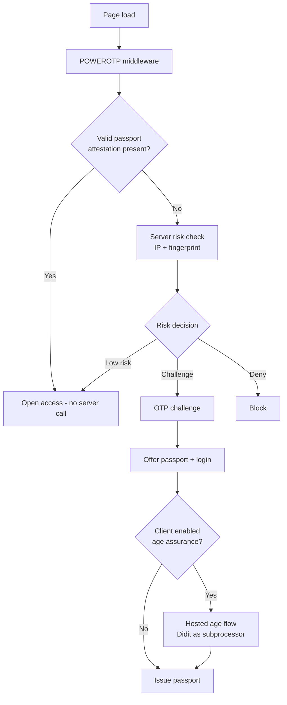

# POWEROTP passport — business and legal plan

Proposed direction for the human-verification passport network. This document describes
intended direction and the legal structure that makes it defensible; it is not a record of
what is deployed. See [`AS_BUILT.md`](AS_BUILT.md) for ground truth and
[`POWEROTP_BOTBLOCKER_PLAN.md`](POWEROTP_BOTBLOCKER_PLAN.md) for the bot-gate implementation
it builds on.

> ## ⭐ THE DIFFERENTIATOR — LEAD WITH THIS
>
> **One verification works across every site in the network — and no site can tell which other
> sites the visitor has been to.**
>
> Both halves are true simultaneously, and the second one is rare: most age-verification vendors
> issue a single shared identifier and therefore *cannot* say it. Every site receives a different,
> unlinkable pseudonym derived as `HMAC(pepper, user_id || client_id)`. Portability and
> unlinkability are separate properties — see
> [Portability is not linkability](#portability-is-not-linkability).
>
> This belongs at the top of the website, the pitch deck, and every security questionnaire
> response. It is worth more than any certification borrowed from a vendor, because a competitor
> can buy the same vendor but cannot claim this without building for it.
>
> **It is also fragile.** It survives only as long as nobody "simplifies" the design to one shared
> cross-site cookie. Guard it in code review.

---

Findings that constrain the design, called out in place:

1. **The passport cannot be delivered as a cross-site cookie or via iframe storage.** Third-party
   cookies are blocked in Safari and Firefox and Safari partitions storage per top-level site.
   See [Passport delivery](#4-passport-delivery-and-the-cookie-constraint).
2. **Unit cost is $0.30, not $0.53** — the white-label add-on and the device/IP module are both
   avoidable, and Didit's free tier is 500 checks *per feature*. At $0.30 the price card is
   profitable at every volume; at $0.53 it is not. See
   [Unit economics](#7-unit-economics-and-pricing).
3. **Age originations must never be bundled into a flat plan**, and new-visitor challenges need a
   per-tier allowance. These are the two metered costs behind unlimited pricing.
4. **We must be the controller, not a reseller**, or cross-network reuse of a verification has no
   lawful basis. See [Data classes and legal roles](#2-data-classes-and-legal-roles).
5. **Certification spend is deferred**, but the controls are designed in from the start. "Built to
   SOC 2 standards" is not "SOC 2 compliant."

---

## 1. What we sell

Three products, one gate, one credential.

| # | Product | What the client integrates | What the visitor experiences |
| --- | --- | --- | --- |
| 1 | **Bot gate** | Middleware at the edge of the client site | Nothing, if they already hold a valid passport |
| 2 | **Human passport** | Nothing extra — same middleware | One OTP, once, then instant entry across the network |
| 3 | **Age assurance** (optional) | Surfaces our hosted flow in an iframe or modal | One document + selfie check, once, then instant entry |

The commercial proposition is not verification. It is that the client site never collects,
stores, or becomes liable for personal data, and never has to answer an age-assurance
question in a security review. Verification is the cost of goods; liability absorption is
the product.

### The three claims we can make that competitors cannot

Ranked by how hard they are to copy. **All three are architectural and cost nothing to assert —
they are worth more than any certificate borrowed from a vendor.**

1. **One verification, every site — and no site can tell where else the visitor has been.**
   Per-client unlinkable pseudonyms. Competitors issuing a shared identifier cannot say this.
   See [Portability is not linkability](#portability-is-not-linkability).
2. **Client sites never receive personal data.** Only a signed boolean and a site-scoped
   pseudonym. Their database stays clean, so their breach exposure on our data is nil.
3. **Biometrics and documents are destroyed on decision and never stored by us.** We keep an
   encrypted date of birth and a signed audit record — never an image.

What we cannot claim, ever: that POWEROTP holds a certification belonging to a vendor. See
[What we must never claim](#what-we-must-never-claim).

### Gate decision order



The fast path costs us nothing: a valid passport is verified offline by the middleware
against our public key, with no network call to our servers. Only unknown visitors reach the
risk engine, and only unknown visitors are billable.

---

## 2. Data classes and legal roles

This is the core of the plan. Three data classes, three legal postures, three stores. They
must never be joinable in a single system.

| Data class | Contents | Our role | Lawful basis | Store |
| --- | --- | --- | --- | --- |
| **Risk signals** | IP, user agent, device fingerprint, velocity, outcome | **Controller** | Legitimate interest (GDPR Recital 47 names fraud prevention) | MongoDB Atlas |
| **Passport identity** | Account, credential, phone/email used for OTP, verified date of birth | **Controller** | Contract with the visitor + explicit consent for biometrics | Supabase |
| **Verification media** | ID document images, selfie, liveness video, biometric templates | **Controller**, Didit is our subprocessor | **Explicit consent** — GDPR Art. 9(2)(a); written consent under BIPA | Didit (transient) |
| **Attestation** | `over_18: true`, audience, expiry, per-client pseudonym | Client is controller of what it does with the boolean | Contract | Client's own systems |

### Why we are a controller, not a reseller

The passport only works if one verification can be reused across many client sites. Reuse is
lawful only if reuse was the **original disclosed purpose** the visitor consented to.

If we resell verification to clients, each client is its own controller with its own purpose,
and reusing Client A's verification for Client B is a purpose change that needs a fresh
lawful basis — which is unobtainable for Art. 9 biometric data, because explicit consent is
purpose-specific and cannot be recycled. The reseller structure makes the product illegal.

So: **the visitor verifies once, with POWEROTP, under our own privacy notice and our own
consent, for our own stated purpose** — "establishing a reusable age and humanity credential
usable at participating sites." Didit is our subprocessor and never has a relationship with
our clients. Clients receive only a signed boolean. Reuse is then not a purpose change; it is
performance of the purpose the visitor agreed to.

This structure also keeps us outside the resale and competing-service restrictions in Didit's
Business Terms (see [Vendor position](#6-vendor-position-and-dependency-risk)).

Clients may **trigger** the age flow through the API without becoming controllers — an API call
does not determine purpose. What determines purpose is who the consent runs to and what comes
back. Which produces a hard product boundary:

| SKU | What the client receives | Controller | Network reuse |
| --- | --- | --- | --- |
| **Age attestation** (the passport product) | Signed boolean + per-client pseudonym only | POWEROTP | **Yes** |
| **Identity data return** (conventional KYC) | Name, date of birth, document data | Client | **No** |

The moment a client receives the underlying identity data for its own purposes, it becomes a
controller, and cross-network reuse of that verification is no longer lawful. These are separate
SKUs with separate terms and they must never be blended. If a client wants the raw data, that
sale is a true resale under Didit §6.3 and the verification cannot feed the passport network.

### Purpose labels must stay separate, including internally

Didit is our vendor for a portion of the service, but that portion is **age assurance**, not
bot defence. The two purposes cannot be merged in our documentation, our consent copy, or our
internal descriptions:

- Bot defence is legitimate interest, no biometrics, notice only.
- Age assurance is explicit consent, Article 9 biometric data, opt-in.

Describing a facial match as part of "user intelligence bot defence" would imply legitimate
interest as the basis, which is not available for Article 9 data and is the single easiest way
to lose a regulatory argument. A DPIA asks what the purpose is, and internal documents are
discoverable in litigation, so the labels need to be accurate everywhere — not just in the
public notice.

### Store separation and the join key

We need to detect passport takeover — a human passing the gate and handing the session to a
bot — which requires linking risk signals to a verified user. That link is the one place the
three classes touch, and it must be built so that neither store alone is sensitive.

- MongoDB holds risk signals keyed **only** by `HMAC(pepper, user_id)`. No names, no contact
  details, no document data, no raw `user_id`.
- The pepper lives in AWS KMS, never in either database. A full Mongo dump is pseudonymous
  and cannot be re-identified.
- Supabase holds identity PII, envelope-encrypted per record with AEAD associated data
  binding each record to `tenant_id | record_id | schema_version`, so ciphertext cannot be
  moved between users by anyone with write access.
- We store the **verified date of birth**, encrypted — not a boolean. Booleans expire wrong
  (a visitor verified at 17 becomes 18) and cannot serve clients who need 13, 16, or 21
  thresholds. One encrypted field derives every threshold.

### Minimum retained attribute — why we cannot hold nothing

The instinct to let Didit hold the identity data and keep only a user ID and behaviour is right
in direction and wrong at the limit. Three reasons we must retain the derived date of birth
ourselves:

1. **Portability.** If Didit is our only system of record for verified age, switching vendors
   loses the verified status of our entire user base. That destroys the multi-sourcing
   strategy, which is our primary protection against §6.4 and 30-day termination.
2. **Threshold flexibility and zero-marginal-cost reuse.** Serving 13, 16, 18, and 21
   thresholds, and handling a visitor who verified at 17 and is now 18, requires the date —
   not a boolean. Querying Didit per request adds cost, latency, and a hard dependency on the
   reuse path that is supposed to be free.
3. **Retention conflict.** We need the documents, images, and biometrics destroyed within days
   for BIPA. If Didit is our system of record, we cannot delete.

So: **destroy everything at Didit, retain the derived attribute here.** A date of birth is a
few bytes, is not biometric, is not a document image, and is envelope-encrypted at rest. We
never hold a photograph.

Two related corrections to the "we hold almost no PII" framing:

- **We hold PII regardless.** The OTP requires a phone number or email address, and the
  passport account needs an identifier. That is personal data, it is unavoidable, and it is why
  the Supabase Team plan is required before real users arrive.
- **Controller liability does not transfer to the storer.** We direct the collection, so we are
  in scope for BIPA and Article 9 regardless of whose disk the image sat on — and Didit's terms
  push the consent obligation and the indemnity back onto us explicitly.

### Retention schedule

BIPA requires this schedule to exist as a **published written policy**, not merely as
behaviour in code. Publishing it is a legal obligation, not documentation hygiene.

| Data | Retention | Mechanism |
| --- | --- | --- |
| ID documents, selfies, liveness video, biometric templates | Deleted on decision, hard cap 30 days | `POST /v3/sessions/:session_id/delete/` on approval; Didit app retention set to the 30-day floor |
| Verification audit evidence (method, timestamp, result, model version, reviewer ID, hash — **no biometrics**) | 7 years | Supabase, encrypted |
| Risk signals for verified users (takeover detection) | 30 days | Mongo TTL index |
| Risk signals for suspected bots | **12 months** | Mongo TTL index |
| Passport identity | Life of account + 90 days | Crypto-shredding — delete the record DEK |

Two corrections to the proposed design are load-bearing:

**Suspected-bot data cannot be retained indefinitely.** The argument that bot data is not
personal data fails for false positives, and a false positive is a real human whose IP and
fingerprint we would hold forever. GDPR storage limitation applies to the whole dataset
because we cannot prove the classification was correct. Cap it at 12 months, keep it
pseudonymous, and purge any record that later resolves to a verified human.

**Deleting the media is correct, but keep the evidence.** A regulator will ask us to prove a
highly effective check happened. Destroying the biometrics while retaining a minimal signed
audit record is what lets us answer without holding the liability.

---

## 3. Consent and notice surfaces

| Surface | Required content | Whose notice |
| --- | --- | --- |
| Bot gate (every page load) | One line: automated-abuse protection, IP and device data processed to prevent fraud, link to our privacy policy | Ours (controller) |
| Passport offer | What the passport is, which sites it works at, that reuse across participating sites is the purpose | Ours |
| Age flow, before camera access | Explicit opt-in consent, **naming Didit as the verification provider**, stating what is collected, why, how long it is kept, and when it is destroyed | Ours |
| Client site terms | The client's own terms and privacy policy for its own service | Client's |

Didit's Verification Privacy Notice requires that customers using white-label or API journeys
"clearly disclose Didit as the verification provider" and obtain any legally required notice
or consent before biometric capture begins. White-labelling changes the branding; it does not
let us omit Didit from the biometric consent. Our consent screen names them.

The bot-gate notice needs no consent gate and no banner — legitimate interest plus notice is
sufficient, and Recital 47 names fraud prevention explicitly. The age flow **does** need
affirmative opt-in, recorded with timestamp, policy version, and the exact text shown.

---

## 4. Passport delivery and the cookie constraint

**A cross-site cookie will not work.** Third-party cookies are blocked outright by Safari's
ITP and Firefox's ETP, and Safari partitions storage per top-level site, so an iframe on our
origin reading `localStorage` from within Client A's page sees a different partition than on
Client B's page. Neither the shared-cookie nor the iframe-storage approach survives contact
with roughly half of real mobile traffic.

Worse, if it did work it would be a cross-site supercookie correlating which age-gated sites
each person visited — the single worst dataset to hold, a certain regulatory problem, and
disqualifying for ISO/IEC 27566-1, which puts privacy-preserving unlinkability in scope.

### The design that works

**Stateless signed attestation, scoped per client, issued by top-level redirect.**

```
{
  "aud": "<client_id>",
  "sub": "HMAC(pepper, user_id || client_id)",
  "over_18": true,
  "human": true,
  "iat": ..., "exp": <iat + 24h>
}
```

- Delivered by a one-time top-level redirect to our domain (the OAuth pattern), which is
  first-party at the moment of the check and therefore works everywhere, then written as a
  **first-party** cookie on the client's own domain.
- Verified offline by the middleware against our published JWKS. No network call on page
  load, no latency, no availability dependency on us, and no per-visit cost to us.
- `sub` is a **per-client pseudonym**. The same visitor presents a different, unlinkable
  identifier at every site. Cross-site correlation is cryptographically impossible rather
  than merely promised — which is the strongest sentence available in a security review and
  the one that makes the network defensible to the ICO.
- 24-hour expiry is the revocation mechanism. Stateless tokens cannot be recalled, so short
  TTLs plus silent re-issue on the next redirect keeps revocation practical without a
  blocklist lookup on every page.

### Portability is not linkability

These are separate properties and the distinction is load-bearing. The passport works at every
client site; the identifier presented at each site is unlinkable to the others. **We know it is
the same person. The client sites cannot tell.**

| Site | What it receives |
| --- | --- |
| `shop-a.com` | `sub: a91f…`, `over_18: true` |
| `forum-b.com` | `sub: 7c2d…`, `over_18: true` |
| `video-c.com` | `sub: e4b8…`, `over_18: true` |

All three admit the visitor with no re-verification. None can determine they are the same human,
because `sub = HMAC(pepper, user_id || client_id)` and the pepper is held in KMS.

If every site saw one shared identifier, any two clients comparing logs — or an attacker who
breached two of them, or a broker buying their analytics — could reconstruct a browsing history
across age-gated sites. That dataset would exist **outside our control**, in client systems where
we set neither retention nor access policy. Per-client pseudonyms keep any possible correlation
inside our infrastructure, where we can decline to build the join at all.

Nothing needed breaks: each client still recognises its own returning visitors, because the
pseudonym is stable on their domain, and we still count unique verified users across the network
for billing and coverage because we hold the mapping.

**Cross-network blocklisting is the one feature that needs linkage, and we perform it.** Keyed by
our internal user ID, we evaluate the ban and either decline to issue an attestation or include a
risk flag. Clients receive a decision, never a shared identifier.

Honest limit: this eliminates the easy, permanent, deliberate join. It does not eliminate
statistical correlation via IP, timing, or fingerprint — signals clients already collect
independently. What we refuse to do is hand them the join key.

**Do not "simplify" this to one shared cookie.** It is the property that makes the network
defensible to the ICO and certifiable under ISO 27566-1.

### BotBlocker's internal fraud correlation vs. the Passport pseudonym — four things that must never be confused

[`POWEROTP_BOTBLOCKER_PLAN.md`](POWEROTP_BOTBLOCKER_PLAN.md) states that "PowerOTP may
correlate pseudonymous fraud/security evidence across protected sites internally." That
sentence describes a *different* mechanism from the Passport pseudonym above, and the two must
stay distinguishable everywhere — in code, in this document, and in any customer-facing
security answer:

1. **Pairwise Passport identifiers exposed to customer sites.** `sub = HMAC(pepper, user_id ||
   client_id)`, one distinct value per site, unlinkable across sites by anyone holding only
   the sites' own data. This is the *only* identifier a customer site ever receives, and it
   identifies a returning verified visitor on that one site — nothing more.
2. **POWEROTP's private internal cross-site fraud correlation.** A capability that runs
   entirely inside POWEROTP's own infrastructure and is never returned to any customer. For a
   Passport-holding visitor it can use `HMAC(pepper, user_id)` (no `client_id` component — see
   the Risk signals data class in [Data classes and legal roles](#2-data-classes-and-legal-roles))
   to detect account/session takeover. For the much larger population of anonymous visitors
   who never register a Passport — the population BotBlocker's bot-risk gate exists to
   evaluate — the equivalent internal key is derived from device/network/behavioral evidence
   (fingerprint, ASN, velocity, decoy signals), not a `user_id`, because that population never
   has one. Both flavors are internal-only inputs to a risk decision; neither is ever surfaced
   to a customer as a value they can store, log, or join against their own data.
3. **No cross-site PowerOTP cookie.** Neither mechanism above is delivered as a cookie readable
   by more than one site. The Passport pseudonym is a first-party, per-site token (see
   [Passport delivery and the cookie constraint](#4-passport-delivery-and-the-cookie-constraint)).
   The internal correlation key never leaves the server side at all, in any form, for either
   population.
4. **No network-global identifier exposed to customers.** A customer dashboard, API response,
   or exported report may show that a specific visitor pattern matches other reports made
   against their own project — an observation, decision, or risk flag — but it never receives
   the pepper, the raw internal correlation key, another project's visitor data, or any single
   identifier that a customer could use to recognize the same visitor on a different customer's
   site. This is the same boundary [`POWEROTP_BOTBLOCKER_PLAN.md`](POWEROTP_BOTBLOCKER_PLAN.md)
   states as "a customer may query only observations belonging to its own project(s)" and the
   same boundary [`THREAT_MODEL.md`](THREAT_MODEL.md#cross-project-data-access) enforces as a
   required test before cross-site intelligence ships.

### "Install once, works everywhere" — what it means mechanically

There is no browser mechanism that stores one artifact readable across unrelated domains. The
visitor-facing promise is still deliverable, but the mechanism is **silent re-issuance per
domain**: the visitor consents once, and every new client domain thereafter performs an
imperceptible top-level redirect that mints a fresh first-party token without any interaction.
That is how cross-domain sign-in works elsewhere. The middleware must therefore handle a
first-visit redirect on every new domain, and it has to be engineered to be invisible — no
flash, no interstitial.

The one-time install step is **load-bearing technically, not just legally**. Safari's bounce
tracking protection deletes website data for domains used purely as redirect intermediaries,
which would silently break the whole network. Domains where the user has a genuine first-party
interaction are exempt. Requiring the visitor to actually visit our domain, consent, and enrol
a passkey creates exactly that interaction and is what keeps the architecture alive. A design
that only ever bounces users silently, with no real first-party relationship, is at risk of
having its cookies purged.

### Cross-device and "install on the device"

- **Passkey (WebAuthn)** as the account credential. Synced through iCloud Keychain or Google
  Password Manager, so it already solves cross-device without us building anything, and it is
  phishing-resistant with no shared secret for us to leak. This replaces "login with 2FA."
- **Wallet credential** as the roadmap version of "install a passport": a verifiable
  credential presented through the W3C Digital Credentials API, with ISO 18013-5/-7 mDL for
  government ID. This is where the standards are going, and it eventually removes our
  dependency on any verification vendor.

---

## 5. Compliance obligations and artifacts

| Regime | Trigger | What we must produce |
| --- | --- | --- |
| **BIPA** (Illinois) | Face geometry from the 1:1 match | Written consent before capture; **published** retention and destruction schedule; no sale of biometrics. $1,000–$5,000 statutory damages per person, private right of action, no injury required |
| **CUBI** (Texas), WA HB 1493 | Same | Consent and destruction timelines; AG enforcement at $25k per violation |
| **CCPA/CPRA** | Biometrics and government IDs are sensitive personal information | SPI disclosures, limited-use commitment, DSAR pipeline |
| **GDPR / UK GDPR** | Art. 9 biometric data, systematic monitoring | Explicit consent records; **DPIA is mandatory** (Art. 35 — large-scale special category plus systematic monitoring); LIA for risk signals; RoPA; DPA templates; SCCs; likely a mandatory DPO under Art. 37(1)(c) |
| **UK Online Safety Act** | Clients relying on us for age gating | Evidence pack against Ofcom's four HEAA criteria: technically accurate, robust, reliable, **fair** — the last requires documented demographic bias testing and an appeals path |
| **ICO Children's Code** | Minors will reach the flow | Best-interests assessment, age-appropriate design |
| **COPPA** | Under-13s will reach the flow | Fail closed, immediate destruction, retain only a hashed denial marker |

### Certification roadmap

Ofcom's 2026 age assurance report states that responsibility for effectiveness remains with
the regulated service **even when outsourced**. Our clients are therefore contractually
obliged to demand evidence from us, and inheriting Didit's certificates is not sufficient —
they cover Didit's components, not our system.

1. **SOC 2 Type II** for POWEROTP. $20–50k audit plus $10–20k tooling plus annual pen test.
   The 3–6 month observation window is the schedule risk; start the clock immediately.
2. **ISO/IEC 27566-1 via ACCS.** The system-level age assurance standard, published 2025 and
   recognised by Ofcom as a compliance pathway. This is the artifact that lets us charge a
   premium instead of competing on list price.
3. **ISO 27001**, following from the Supabase and vendor posture.

### What we must never claim

That clients have no privacy obligations (tokenised and attested data is pseudonymous, not
anonymous — the client remains a controller for what it stores), that we are "SOC 2
compliant" because our vendors are, or that age assurance is guaranteed. Contracts mirror
Ofcom's allocation: we supply a highly effective process and the evidence for it; the client
remains responsible for its own duties.

---

## 6. Vendor position and dependency risk

Didit is the launch verification vendor at $0.33 per KYC bundle plus $0.20 white-label,
500 sessions free monthly, with abandoned and declined sessions free. We inherit iBeta
Level 1 PAD, SOC 2 Type I and II, ISO/IEC 27001, and the Tesoro/SEPBLAC attestation as
evidence. Data is processed in the EU on AWS by default.

### Terms already reviewed

| Clause | Finding |
| --- | --- |
| §7.2 | We are sole owner of Client Data — we own the verification result |
| §6.3 | Resale and sublicensing expressly permitted, subject to four conditions |
| §6.4 | **Cannot build a competing identity verification service "or [use] any information obtained therefrom"** |
| §6.4 | Cannot train ML/AI models on verification results without written consent |
| §11 | Liability capped at trailing 12-month fees, 2× for data-breach claims |
| §4.2 | Either party may terminate for convenience on **30 days** |
| §7.3 | Perpetual, irrevocable licence to any feedback we send them |
| Retention | Defaults to **indefinite** unless configured; 30-day floor, 10-year ceiling |
| Model training | They train fraud models on pseudonymised verification data as independent controller by default; opt out by deleting the record or in writing |

Commercial terms that work in our favour and should be relied on deliberately:

- **No contracts, minimums, or lock-in** on self-serve; prepaid credits never expire.
- **Billed only on completion** (Approved, Declined, In Review). Abandoned sessions are free,
  so funnel drop-off costs nothing.
- **Volume-based bonus credits on larger prepaid purchases** — the only self-serve discount
  mechanism, available without a contract. Amount unpublished; ask before committing to the
  deep tiers of our own price card.
- **60 days' notice before any price rise**; annual-commit and Enterprise rates lock for the
  term; published price drops pass through to self-serve customers automatically.

The price-protection terms materially reduce the vendor risk flagged below, but only if we sign
an annual commit or Enterprise Order Form. Self-serve gets the 60-day notice, not the lock.

### Required before build

1. Written carve-out confirming a reusable age-attestation service operated on top of Didit
   verifications is permitted under §6.2 and §6.3 and outside §6.4.
2. Volume pricing committed in an Order Form — see [Unit economics](#7-unit-economics-and-pricing);
   the price card does not work at list.
3. Retention configured to the 30-day floor, and the contradiction between the advertised
   "5-year default" and the documented "indefinite default" resolved in writing.
4. Model-training opt-out in writing.
5. Termination notice extended beyond 30 days with a migration window, and unused prepaid
   credits refundable on our termination.
6. Sub-processor list and certificate of insurance under NDA.
7. Negotiated liability cap for biometric breach — the standard cap is not survivable against
   BIPA statutory damages.

Frame this as a customer conversation with a volume commitment, not as a description of a
credential network. Do not describe the passport architecture in a support ticket (§7.3).

### Multi-sourcing is mandatory, not optional

The verification backend sits behind one internal interface — `verify() → attestation` — with
Didit, FaceTec, Persona, or Veriff interchangeable, and an mDL wallet presentation as the
eventual fourth. No vendor SDK type may appear in our own API contracts.

This converts §6.4 and the 30-day termination clause from existential threats into pricing
negotiations, and it is the only defence against the predictable end-state where we become a
large share of a vendor's volume while owning all the client relationships.

### FaceTec — the upgrade path, and when to take it

FaceTec is not a verification service; it is a **biometric SDK licensed to run on our own
servers**, covering 3D liveness, 3D face matching, and photo ID OCR with barcode and NFC chip
reading. No end-user biometric data or PII is sent to FaceTec.

What it buys us:

| | Didit (launch) | FaceTec (upgrade) |
| --- | --- | --- |
| Where biometrics are processed | Didit's infrastructure (EU/AWS) | **Ours** |
| Biometric sub-processor to name in consent | Required — Didit must be disclosed | **None** |
| PAD certification | iBeta **Level 1** | iBeta/NIST **Levels 1 and 2**; claimed Levels 1–5 PAD and injection-attack detection at 0% FAR; public spoof bounty since 2019 |
| Injection / deepfake stream resistance | Not covered by Level 1 | Covered |
| False accept rate | not published | 1 / 125,000,000 at <1% FRR |
| Document reading | Included | Included free for customers/partners |
| Document **authenticity** forensics | 14,000+ document types | **Not included — needs Regula or Microblink** |
| Competing-service restriction | §6.4 applies | **None** — embedding is their business model |
| Pricing | $0.30/session, 500 free per feature | Monthly minimum, enterprise contract, no public rate, no free tier |

The certification gap is the one that matters for age assurance specifically. Our adversary is a
motivated minor with access to a parent's ID and free deepfake tooling, and injection attacks —
feeding a synthetic stream through a virtual camera — are outside standard PAD levels entirely.
Ofcom's "robust" criterion is where this gets tested.

Costs of the path: a required monthly minimum that would be significant against early MRR
(mitigated by FaceTec's stated route through **distribution partners with no monthly
commitment** — obtain that list), a second vendor for document authenticity, our own compute and
ops, and an expanded SOC 2 scope now that we process biometrics in our own environment. The
developer account is free, so evaluation costs nothing today.

**Do not use FaceTec's biometric re-authentication.** It requires retaining a face template
long-term, which is precisely the BIPA exposure we are engineering away from. New-device recovery
stays on passkeys.

Trigger conditions for the upgrade: a client demands iBeta Level 2 or injection-attack
resistance (any UK OSA-facing or adult-content client eventually will); an ISO 27566-1 assessor
presses on PAD robustness; a client requires that biometrics never leave our infrastructure or
needs residency Didit's EU default cannot satisfy; Didit declines the §6.4 carve-out; or volume
crosses over — quoted monthly minimum ÷ $0.30 = the sessions per month above which a commitment
beats per-check pricing.

Component licences generally (FaceTec, Regula, Microblink, ID R&D) are the fallback if the
carve-out is refused, and they carry the strongest privacy story available to us.

---

## 7. Unit economics and pricing

### Actual unit cost is $0.30, not $0.53

Didit bills per *feature*, summed per workflow, and the free tier is **500 checks per feature
per month per organisation** — not 500 bundles. White-label is a paid **add-on**, not a
discount for co-branding: $0.20 per session buys our branding and our own domain, and
declining it means the flow runs Didit-branded on `verify.didit.me`.

Our minimum age workflow needs three features:

| Feature | Price | Free tier | Needed? |
| --- | --- | --- | --- |
| ID Verification | $0.15 | 500/mo | Yes — carries the date of birth |
| Passive Liveness | $0.10 | 500/mo | Yes — required PAD |
| Face Match 1:1 | $0.05 | 500/mo | Yes — binds face to document |
| Device & IP Analysis | $0.03 | 500/mo | **No** — we run our own fingerprinting |
| Whitelabel | $0.20 | — | **No** at launch |
| Biometric Authentication | $0.10 | — | **No** — passkeys do this for free |
| Phone / Email Verification | $0.04+ / $0.03 | — | **No** — OTP is our own product |
| Reusable KYC | Free | — | Evaluate; see vendor risk |

**Unit cost is $0.30.** Dropping Device & IP Analysis saves $0.03 because we already collect
those signals ourselves, and declining white-label saves $0.20.

At $0.30 the effective cost after the free allowance never exceeds $0.2985, so the proposed
price card is **profitable at every volume**:

| Age originations/month | Effective cost | Margin at $0.35 |
| --- | --- | --- |
| 1,000 | $0.150 | 57% |
| 5,000 | $0.270 | 23% |
| 10,000 | $0.285 | 19% |
| 100,000 | $0.2985 | 15% |

For contrast, buying white-label back at $0.53 inverts this — effective cost climbs to $0.527
at scale, break-even for a $0.35 price arrives at just 1,472 sessions/month, and the deepest
tier becomes the biggest loss. The $0.20 add-on is therefore the difference between a viable
and an unviable price card.

The tradeoff for declining it is polish, not compliance: we are **required** to name Didit in
the biometric consent regardless, so a Didit-branded flow is consistent with a disclosure we
cannot avoid. Since abandoned sessions are free, the real cost is funnel drop-off from an
unfamiliar mid-flow domain.

**Decision: launch at $0.30 with no white-label, measure completion, and only buy the $0.20
back if conversion loss exceeds the 40% of margin it consumes.**

Prepaid credit bonuses are the only self-serve discount mechanism and the schedule is **not
published** on either the pricing page or the developer docs — it must be obtained from sales
before committing to the deep tiers.

### The subscription absorbs the loss only if originations are capped

The origination price is a loss leader sitting on top of a $99/month unlimited-visits
subscription plus a per-1,000-return-visitor fee. That is a sound structure — return traffic
costs us nothing, so it is near-100% margin — but the loss leader must be **bounded**, for two
reasons.

**Unbounded originations invert the incentive.** At −$0.18 per age origination, $99/month
absorbs roughly 550 originations. A client originating 5,000 new verified users a month costs
us $900 against $99 of revenue. That means the clients who grow the network fastest are the
ones who lose us the most money — the opposite of what the pricing should reward.

**The cold start is where it bites hardest.** Network coverage is 0% on day one, so at launch
essentially every visitor is an origination:

| Launch client, 10,000 visitors/month | Network coverage | Cost | Revenue | Result |
| --- | --- | --- | --- | --- |
| Month 1 | 0% | $5,300 | ~$99 | **−$5,200** |
| Month 12 | 90% | $530 | $99 + return fees | Profitable |

The model is only viable in steady state, and the loss is largest at the moment we have the
least cash. A single mid-sized launch client on an uncapped plan is a five-figure hole.

### The fix: included allowance plus metered overage

| Origination type | Cost to us | Price | Gross margin |
| --- | --- | --- | --- |
| **Bot/OTP origination** | ~$0.001–0.05 | $0.50 → $0.35 by volume (card as proposed) | 90%+ |
| **Age origination**, within plan allowance | $0.53 at list | absorbed by subscription | loss leader, bounded |
| **Age origination**, above allowance | $0.53 at list | **$0.65 → $0.85** metered | 18–38% |
| **Return visit** (passport presented) | $0.00 | per-1,000 fee | ~100% |

The $99 headline stays. It includes a defined number of age originations — sized so the
subscription still nets positive — and everything above that is metered at or above cost.
This keeps the loss leader as a customer-acquisition subsidy rather than an unlimited
liability, and it removes the perverse incentive against growth.

Two levers improve the underlying cost: a negotiated Didit rate (they discount at scale, with
custom contracts above 100k/month — reaching $0.35 retail requires a cost below ~$0.20, a
~62% discount, which must be secured *before* publishing that number), and dropping the $0.20
white-label fee for clients who don't require our branding on the flow, which alone moves a
$0.85 price from 38% to 62% margin.

Retaining a flat uncapped card is defensible only as a **blended** price where age
verification is a minority of originations. For an adult-content client where every visitor
needs a document check, an uncapped blended card guarantees losses on the largest accounts.

### Why the network economics work anyway

Verification is a one-time cost; reuse is free. That is the entire business.

A site seeing 100,000 age-gated visitors, of whom 90% already hold a network passport:

| Route | Cost to the client |
| --- | --- |
| Direct to a vendor at $0.53 per visitor | **$53,000** |
| Through POWEROTP: 10,000 originations at $1.00 + plan fee | **~$11,000** |

Five times cheaper for them, healthy margin for us, and the ratio improves for both sides
with every site that joins. This is the pitch, and it also answers the vendor-relations
question: we are not skimming a vendor's customers, we are the channel that makes age
assurance affordable for a segment that cannot buy it at $0.53 per visitor with no reuse.

### Target book and the guardrails it requires

| Tier | Clients | Price | MRR |
| --- | --- | --- | --- |
| Starter | 250 | $5 | $1,250 |
| Growth | 200 | $20 | $4,000 |
| Scale | 50 | $50 | $2,500 |
| Unlimited | 10 | $99 | $990 |
| **Total** | **510** | ARPU $17.14 | **$8,740/mo — ~$105k ARR** |

That is a healthy self-serve business against a lean cost base (Supabase Team $599, Atlas,
hosting, insurance — roughly $1,200–1,500/month fixed), leaving around $7,300/month of gross
margin before variable costs. At $17 average revenue per account it is strictly product-led:
no sales calls, and customer acquisition cost must stay under roughly $50 to work.

It also cannot fund a $11,400/month certification stack — see below. And it imposes two
non-negotiable guardrails, because every tier is flat while two of our costs are metered:

**1. Age originations are never included in a flat plan.** A $20/month client running 5,000 age
verifications costs $1,500 at $0.30. Age is always metered on top, at every tier, without
exception. This is the single most important pricing rule in the document.

**2. New-visitor challenges need an allowance; passport reuse does not.** Returning visitors
cost nothing — the middleware verifies the token offline — so "unlimited visits" is safe to
promise for *return* traffic. But a $5/month client with 10,000 unknown visitors triggering SMS
OTP at $0.005–0.05 is a $50–500 bill. So: **email OTP is the default challenge** (we already run
`email-otp-service` on Brevo at a fraction of a cent), SMS and voice are paid upgrades, and each
tier carries a defined challenge allowance with metered overage.

Restated, what each plan actually sells is unlimited *passport verifications* — the part that is
free to serve — plus an allowance of the parts that are not.

### Infrastructure and compliance cost stack

| Line | Cost | Note |
| --- | --- | --- |
| Supabase Team | $599/mo | Required before any real user PII lands — SOC 2 and ISO 27001 are Team-and-above only |
| Supabase HIPAA add-on | **$0 — do not buy yet** | ~$350/mo. Age and identity data is not PHI; only needed if a health vertical client requires a BAA. Saves ~$4,200/yr. See caveats below |
| MongoDB Atlas | existing | Risk signals only |
| AWS KMS | ~$1/key/mo + $0.03/10k requests | Envelope keys and the pseudonym pepper |
| Didit | $0.53/session, 500 free/mo | Declined and abandoned sessions are free |
| SOC 2 Type II | $20–50k + $10–20k tooling | Annual |
| ISO 27566-1 (ACCS) | quote required | The premium-pricing artifact |
| Cyber and tech E&O insurance | quote required | See risk register — must explicitly cover biometric statutory damages |

### Deferring the HIPAA add-on is correct, but activation is not one click

Building the system to a compliant standard now and paying for HIPAA only on demand is the right
sequencing — age and identity data is not PHI, so the add-on buys nothing until a health-vertical
client appears. Two caveats on the activation path:

**It is a short project, not a toggle.** Enabling it requires the Team or Enterprise plan, a
signed BAA with Supabase, the add-on purchased, and each project reconfigured as *High
Compliance*: point-in-time recovery (which itself requires a paid compute add-on), SSL
enforcement, network restrictions, and Postgres connection logging, with continuous checks
surfacing violations in the Security Advisor. Days rather than months — but **network
restrictions can break application connectivity**, so rehearse the change in staging before
promising a date to a client.

**A Supabase BAA does not let us offer BAAs.** Supabase's BAA covers the Supabase layer only. To
be a business associate to a covered entity we need our own HIPAA programme — Security Rule
safeguards, risk analysis, workforce training, breach-notification procedures — and our own
signed BAA with each client. Offering BAAs is a compliance programme, not a line item.

### Compliance is the product, not an add-on tier

A separate "$199/month for full compliance" tier does not work, for a structural reason:
**audit scope is the environment, not the customer.** If some clients' PII sits in a
non-compliant configuration on the same infrastructure, that infrastructure is either inside
the SOC 2 scope (and fails the audit) or requires genuinely separate infrastructure at double
the cost. There is no half-compliant posture.

The compliance stack is also a fixed cost, not a per-client one. Once Team, SOC 2, ISO 27566-1,
and insurance are in place, every client benefits at zero marginal cost — so the honest
question is how many subscribers fund the stack:

| Line | Monthly equivalent |
| --- | --- |
| Supabase Team | $599 |
| SOC 2 Type II (audit + tooling + pen test, ~$70k/yr) | ~$5,800 |
| ISO 27566-1 via ACCS (estimate, quote required) | ~$2,500 |
| Cyber and E&O with biometric coverage (estimate) | ~$2,500 |
| **Total** | **~$11,400** |

Against a $105k ARR target book, that stack is more than the entire business. So it is deferred,
and the sequencing is deliberate:

**Design to the controls now; buy the attestations when a client demands them.** Building to SOC 2
and HIPAA-grade controls from the start is genuinely cheap — encryption, least privilege, audit
logging, environment separation, retention enforcement, and separation of duties cost almost
nothing if they are designed in rather than retrofitted. What costs money is the *audit*, the
evidence machinery, and the observation window. At $5–$99 self-serve there are no security
questionnaires, so the certificates buy nothing until we move upmarket.

The one line not to cross: **"built to SOC 2 standards" is not "SOC 2 compliant."** The first is
true and useful in marketing copy; the second is a false statement that a single enterprise
buyer's counsel will catch, and it is the same error we advise clients not to make about
Supabase.

**Segment the pitch accordingly.** For low-volume retailers and vibe-coded apps, the buying
trigger is not compliance — it is wasted page loads and API spend on bot traffic, plus fear of a
lawsuit they cannot quantify. Lead with measurable bot-cost savings and "you never store user
PII"; let the compliance posture be the reassurance rather than the pitch. Certification spend
belongs in the phase where an enterprise client with a questionnaire is on the table.

The interim data line is real user data, not first revenue: build and test on Supabase Free or
Pro with **no real user data**, and move to Team the moment real PII lands. A compliance period
cannot be made retroactive — data stored on a non-attested plan sits outside any later audit
window and is uninsured for that stretch.

---

## 8. Risk register

| # | Risk | Severity | Mitigation |
| --- | --- | --- | --- |
| 1 | Negative margin on age originations | **Blocking** | Unbundle the price card; secure Didit volume pricing before publishing rates |
| 2 | BIPA class action | **Existential** | Consent before capture naming Didit; published destruction schedule; immediate media deletion; insurance underwritten for biometric statutory damages |
| 3 | Passport silently fails in Safari and Firefox | **Blocking** | Top-level redirect issuing first-party tokens, plus passkeys; never third-party cookies or iframe storage |
| 4 | Cross-site correlation becomes the story | High | Per-client pseudonyms, no global identifier, publish the design, pursue ISO 27566-1 |
| 5 | Didit invokes §6.4 or terminates on 30 days | High | Written carve-out, committed term, vendor-agnostic abstraction, component-licence fallback |
| 6 | Cyber policy excludes or sub-limits BIPA | High | Frequently excluded — underwrite specifically for biometric statutory damages, not generic cyber |
| 7 | SMS pumping / toll fraud on the OTP path | Medium | Per-IP and per-prefix velocity caps, country allowlists, cost alerting |
| 8 | Client fails its OSA duties and blames us | Medium | Contractual allocation mirroring Ofcom; supply the HEAA evidence pack; never guarantee compliance |
| 9 | Minor's biometrics captured | High | Fail closed, destroy immediately, retain only a hashed denial marker |
| 10 | One Supabase org holds every tenant's PII | Medium | Per-tenant isolation, RLS plus per-record encryption, clients never receive dashboard access |
| 11 | False-positive bot data retained indefinitely | Medium | 12-month cap, pseudonymous storage, purge on resolution to a verified human |
| 12 | Platform age APIs commoditise app use cases | Medium | Apple Declared Age Range and Google Play Age Signals cover apps, not the web, and include self-declaration. Integrate them as a fast path; the web and cross-site reuse remain defensible |

---

## 9. Sequencing

**Phase A — decisions before code.** Didit carve-out and volume pricing in writing. Counsel
engaged on the controller structure and BIPA consent text. Cyber and E&O quotes with
biometric coverage confirmed. SOC 2 observation window started. Price card unbundled.

**Phase B — legal artifacts.** Published retention and destruction schedule. DPIA. LIA for
risk signals. Privacy policy, verification notice, consent copy. Client DPA and terms
allocating OSA responsibility. Sub-processor register.

**Phase C — passport rails.** Redirect-based attestation issuance, JWKS and rotation,
per-client pseudonym derivation, middleware verification library, passkey enrolment. Store
separation and the KMS-held pepper. Retention TTLs enforced in code and verified by test.

**Phase D — age flow.** Didit behind the `verify()` interface, hosted cross-origin, consent
gate, immediate session deletion on decision, encrypted DOB storage, audit evidence record,
human review console with no-download and watermarking.

**Phase E — evidence and certification.** Bias testing across demographics, appeals path,
HEAA evidence pack, ACCS engagement for ISO 27566-1, second verification vendor integrated
behind the same interface.

---

## 10. Open questions requiring counsel

1. Does the controller-with-subprocessor structure hold in the US and EU, such that one
   consent lawfully supports reuse across all participating sites?
2. Is our biometric consent text sufficient under BIPA given that capture happens in a Didit
   flow we host and brand?
3. Is fingerprinting at the bot gate defensible under ePrivacy Art. 5(3) as strictly
   necessary for security, or does it require consent in the EU and UK?
4. Are we a joint controller with client sites for any part of the gate decision?
5. Does pooling risk signals across clients to improve scoring require anything beyond our
   own notice and legitimate interest?
6. Do we require a DPO and an EU representative from day one?
