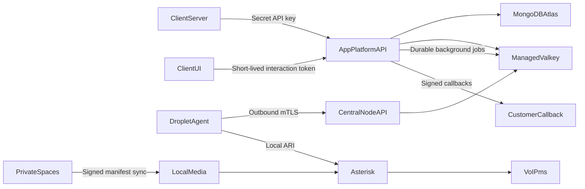

# POWEROTP delivery plan

This is the approved implementation direction for POWEROTP. The system is a central
verification control plane on DigitalOcean App Platform with geographically scalable
Asterisk nodes.

See [`AS_BUILT.md`](AS_BUILT.md) for what is actually deployed and running right now,
including deviations from this plan and infrastructure with real credentials behind it.
This file describes intended direction; `AS_BUILT.md` describes ground truth.

Implementation status: Phases 0, 1, 2, 3, and Phase 6's SMS provider adapter are
implemented. Phase 2 requires the
production Atlas, Valkey, Brevo, domain, and cryptographic configuration listed in
[`PHASE2_OPERATIONS.md`](PHASE2_OPERATIONS.md) before activation. Phase 3's durable
queue (idempotent creation, dispatch, timeouts, and signed callback retries) runs on the
same Valkey instance via BullMQ and stays idle until `VALKEY_URL` is provisioned; real
real transports arrive in Phases 4–6. Voice types 1 and 2 have node/ARI call-control;
SMS has an in-process VoIP.ms HTTPS adapter. Each still fails closed with
`method_not_available` until its dedicated live credentials are configured. The durable
state machine, events, callbacks, and interaction tokens are fully exercised by automated
tests using a test-only fake transport that never runs outside `*.test.ts` files.

## Product contract

| Type | API name | Result |
| --- | --- | --- |
| 1 | `call_reachability` | Reports whether the destination answered; it does not prove ownership. |
| 2 | `voice_code` | Repeats a five-digit code and validates the code submitted by the client. |
| 3 | `voice_challenge` | Plays a POWEROTP recording, returns question/options JSON, and validates opaque answer IDs. |
| 4 | `sms_code` | Sends and validates a five-digit SMS code through a provider adapter. |

Each customer project receives a stable API URL, a server-side secret API key, callback
configuration, allowed browser origins, enabled methods, and usage history. Customer
requests always reach App Platform first. Telephony droplets never expose a customer API.

## Architecture

- The React application uses Next.js; there is no Vite frontend.
- The deployed system has one production code path. Mocks exist only in automated tests.
- MongoDB Atlas is durable storage. Valkey holds queues, leases, rate limits, and short-lived state.
- Asterisk and its agent run natively under hardened `systemd` units. Portainer and
  containerized Asterisk are intentionally excluded.
- App Platform holds master secrets. Every droplet enrolls once, receives a unique
  revocable mTLS identity, and pulls only its assigned encrypted configuration.
- Canonical recordings live in private DigitalOcean Spaces and are checksum-synchronized
  to local droplet storage.

## API lifecycle

Creation returns `202 Accepted`, an `interactionId`, `statusUrl`, expiration, and an
optional short-lived interaction token. Accepted means queued, not delivered.

The canonical lifecycle is:

`queued → dispatching → calling → ringing → answered → playing → awaiting_response → succeeded|failed|expired|canceled`

Methods skip states that do not apply. Every callback has a unique event ID, interaction
ID, monotonic sequence, state, event time, and stable reason code. Callbacks are signed
with HMAC, retried independently, and never alter the verification result.

Interaction tokens are limited to one project, interaction, origin/application, action,
nonce, and expiration. They cannot create verifications or read project data and are
consumed after submission or a terminal result.

## MCP

`https://powerotp.com/mcp` is a public, anonymous, read-only Streamable HTTP MCP
server (routed by path on the single shared domain; there is no separate `mcp.`
subdomain today). It teaches Cursor, Claude, and other clients how to implement the
API. It has no project access, credentials, customer data, or billable tools and cannot
originate calls or SMS.

## Phases

### Phase 0 — Product and risk definition

- Freeze API terminology, states, consent rules, supported countries, retention, retries,
  limits, and success criteria.
- Confirm VoIP.ms trunks, concurrency, caller IDs, codecs, SMS capability, and acceptable use.
- Approve the threat model, provider checklist, and MVP acceptance criteria.

### Phase 1 — Production foundation

- Create the TypeScript monorepo, Next.js site, Fastify API with durable background
  processing, MCP server, telephony-agent boundary, shared contracts, tests, and CI.
- Add one production App Platform specification with encrypted variable declarations,
  health checks, canary controls, and rollback documentation.
- Establish the exact folder and build commands used by App Platform.

### Phase 2 — Accounts and projects

- Add separate customer and platform-admin login paths.
- Add projects, stable URLs, API-key lifecycle, callbacks, origins, settings, and audit logs.

### Phase 3 — Verification core (implemented)

- Implement idempotency, durable state transitions, events, queues, signed callbacks,
  interaction tokens, status lookup, and dashboard timelines.
- Transports for real telephony/SMS are intentionally deferred to Phases 4–6; Phase 3
  ships the shared machinery plus a test-only fake transport for automated coverage.

### Phase 4 — Voice types 1 and 2

- Provision native Asterisk, PJSIP, local ARI, agent watchdogs, mTLS enrollment, health,
  leasing, failover, VoIP.ms trunk routing, and composable digit playback.

### Phase 5 — Voice challenges (implemented)

- Add recording processing/publication, question and answer administration, media
  manifests, headless challenge JSON, answer validation, and optional hosted iframe.

### Phase 6 — SMS (provider adapter implemented)

- Add SMS through a provider adapter with normalized delivery status and suppression rules.

### Phase 7 — Analytics and diagnostics

- Add project counters, interaction rows, callback diagnostics, reconciliation, alerts,
  retention, and operator health views.

### Phase 8 — Integration surface

- Finish API documentation, SDK starters, widget loader, MCP tools/resources, and
  “Copy this to your AI” instructions.

### Phase 9 — Production hardening

- Add multi-node routing, circuit breakers, failure injection, load/security testing,
  restore drills, incident runbooks, abuse controls, and controlled rollout limits.

## Release rule

Every phase must pass automated tests, canary checks against allowlisted destinations,
security review proportional to its risk, and a documented rollback before release.
