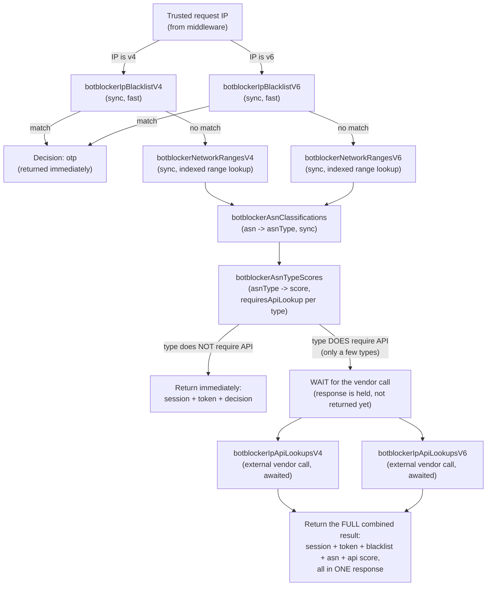

# BotBlocker Phase 16 — Network intelligence design plan

**Status: design only, not implemented.** No code in this repository has been changed to
implement anything described here. This document is the durable, repo-tracked record of a
design session so a fresh session (on any machine, or a cloud agent with no access to this
machine's local Cursor plan cache) can pick up execution with full context. It is not an
as-built entry — do not cite it as evidence anything below has shipped.

Ground truth for what has actually shipped remains
[`POWEROTP_BOTBLOCKER_AS_BUILT.md`](POWEROTP_BOTBLOCKER_AS_BUILT.md). The canonical phase
sequence remains [`POWEROTP_BOTBLOCKER_DEVELOPMENT_PHASES.md`](POWEROTP_BOTBLOCKER_DEVELOPMENT_PHASES.md)
(this is Phase 16, "Rapid allowlist/blacklist," expanded in scope per explicit user direction
to include real ASN/network classification — see "Scope note" below). The product/architecture
spec remains [`POWEROTP_BOTBLOCKER_PLAN.md`](POWEROTP_BOTBLOCKER_PLAN.md).

## Scope note: why this phase is larger than the original Phase 16 charter

The development-phases document defines Phase 16 narrowly ("Implement real versioned
allow/blacklist entries..."). During design, the user directed an expanded scope: real ASN/IP
network classification and scoring infrastructure (normally anticipated for Phase 17), because
the underlying data-layer decisions (MongoDB collection shape, v4/v6 split, lookup algorithm)
needed to be made together. This document reflects that expanded, user-directed scope. Anything
below that oversteps the original Phase 16 charter is intentional and user-approved, not scope
creep — see the "Explicit exclusions" section for what remains deliberately out of scope
(notably: no final weighted/thresholded score combination — that still requires Phase 17's
user-supplied weights/decay/threshold rules).

## Corrections made during this design session (read this first)

Several design decisions in earlier drafts of this plan were later corrected by the user after
being challenged/clarified. This section exists so a fresh session doesn't repeat the same
mistakes:

1. **IP hashing is being removed, not kept.** An earlier session (Phase 15) stored only an
   HMAC-SHA-256 hash of visitor IPs in `userIntelligence`/`gateSessions`, documented as a
   privacy control in the threat model and SOC2/ISO27001 control matrix. The user never approved
   this and it blocks two explicit needs: showing raw IP in site-owner visitor reports, and using
   raw IP as a return-visit signal. Neither SOC 2 nor ISO/IEC 27001 mandates hashing IPs (both
   are principles-based against an org's own risk assessment, not a fixed technical checklist).
   **Decision: store the raw IP everywhere; remove the hashing step entirely.**
2. **There is no admin-managed "override" list.** An earlier draft of this plan (and a
   pre-existing scaffolded stub already in the codebase from an even earlier session —
   `OperatorRapidListMutationSchema`, `/v1/control/botblocker/rapid-list` route,
   `rapidListIndicatorKinds`) assumed a generic manual admin override mechanism (allow/blacklist
   by ip_prefix/asn/fingerprint_hash/passport_subject). **The user corrected this: there is no
   override. The only admin-facing configuration is a score per ASN type
   (`botblockerAsnTypeScores`), which is source-of-truth scoring configuration, not an override.
   The existing scaffold should be removed entirely, not narrowed or renamed.**
3. **"Rapid list" is not a separate mechanism.** It refers to the same master tables (blacklist,
   ASN/network ranges, API-lookup cache) physically replicated to edge/rapid servers
   (verify.powerotp.com, Phase 26/27, not built) with a 30-day retention window, versus 18-month
   history on the Mongo master. This phase only builds the Mongo master tables.
2b. **Individual-IP blacklist must be a dedicated table, not reused from the generic list.** The
   reason is pure latency: a small, single-purpose, indexed table is faster to scan than an entry
   mixed into a larger multi-purpose list, and this directly serves the sub-50ms decision-latency
   target already stated in `POWEROTP_BOTBLOCKER_PLAN.md`.
4. **Fingerprinting is the existing Phase 15 mechanism, not a new collection.** It's the
   already-collected browser fingerprint data (screen resolution, browser type, capabilities,
   etc. — `BrowserEnvironmentEvidence`/`userIntelligence.fingerprintHash`), used to correlate the
   same visitor/bot across changing IPs (proxies rotate IPs but often reuse the same browser). No
   new schema needed for this in Phase 16.
5. **Enrichment lands on the gate session row, not directly on `userIntelligence`.** Session rows
   accumulate on the existing 5s-initial/30s-recurring cadence; a decision-generator re-running on
   every row change (Phase 17 scope) is what aggregates into `userIntelligence` — this phase
   contributes the session-level network-classification input only, it does not build the
   aggregation/decision-generator.
6. **Timing: exactly two response branches, no fire-and-forget.** Corrected twice during design
   to reach the final model — see "Runtime integration" below. The ASN/subnet classification
   lookup is synchronous (fast, local, indexed Mongo, no network call), not deferred background
   work. Only the external vendor API call is genuinely latency-variable, and even that is
   **awaited**, not fire-and-forget: if a resolved ASN type requires it, the whole response waits
   for it and returns one complete combined result. There is no "respond now, background-update
   later" path anywhere in this design.
7. **Passport/paid-allow blacklist bypass is a documented future note, not built now.** Business
   rule for later: a blacklisted visitor holding a paid Passport, on a site with a "paid allow"
   setting enabled, receives `allow` instead of `otp`; an ordinary (non-paid) Passport holder is
   *not* exempt from `otp` recommendations. This depends on Passport/PaidTokenPass (Phase 21-23),
   which has zero implementation today — building bypass logic against a system that doesn't
   exist would mean faking the passport check. Recorded here only so it isn't lost.
8. **A signed snapshot export was proposed by the assistant (not requested by the user), then
   dropped.** It would let a future edge (Phase 26/27, not built) verify a copy of the rapid data
   without a live callback — but nothing consumes it yet, so it's excluded from this phase.
9. **No MaxMind import pipeline.** Corrected during the IP-hash-reversal/blacklist session
   (2026-08-16): the user loads each MaxMind GeoLite2-ASN CSV into MongoDB directly (manually, or
   Cursor-assisted), not through repository-owned import code. This phase only defines the
   `botblockerNetworkRangesV4`/`V6` collection shape and indexes a manual load must match.

## Data model

Six physical MongoDB collections, all in `backend/packages/api/src`, split into v4/v6 pairs for
the three latency-sensitive lookups (dedicated single-purpose tables scan faster than one mixed
into a larger collection):



### 1. `botblockerNetworkRangesV4` and `botblockerNetworkRangesV6` — separate collections per family

Physically separate (not one collection with a `family` filter field) so an IPv4 lookup only
ever touches the IPv4 collection's own storage/index/working-set, and vice versa. Also lets each
MaxMind file (already shipped as two separate CSVs) refresh independently.

- **`botblockerNetworkRangesV4`**: `_id`, `rangeStart`/`rangeEnd` (plain unsigned 32-bit
  integers — no hex-string encoding needed since the collection is already v4-only), `cidr`,
  `prefixLength`, `asn`, `asnOrg`, `sourceDataset: "maxmind_geolite2_asn"`, `importBatchId`,
  `importedAt`. Index: `{ rangeStart: 1 }`.
- **`botblockerNetworkRangesV6`**: same shape, but `rangeStartHex`/`rangeEndHex` (fixed-width
  32-char zero-padded lowercase hex — 128-bit values don't fit safely in a JS/BSON number, and
  `Decimal128` can't hold the full IPv6 range exactly; a fixed-width zero-padded hex string sorts
  identically to numeric comparison). Index: `{ rangeStartHex: 1 }`.
- Lookup: parse the request IP's family (reuse the existing `normalizeIp`, extracted for this
  purpose into [`backend/packages/api/src/ip-utils.ts`](../backend/packages/api/src/ip-utils.ts)),
  query only the matching collection — greatest `rangeStart(Hex) <= ip`, confirm
  `ip <= rangeEnd(Hex)`. Same "flat non-overlapping partition" technique MaxMind/IPinfo's own
  flat-file products use — O(log n) via a single B-tree index per collection.
- **Import: no application code.** Corrected during the IP-hash-reversal/blacklist session
  (2026-08-16) — the user will load each MaxMind GeoLite2-ASN CSV directly into MongoDB manually
  (e.g. `mongoimport`, or a Cursor-assisted one-off load), not through a repository-owned import
  pipeline. This phase only needs to define the collection shape/indexes above so a manual load
  lands in the right place; no `botblocker-network-ranges-import.ts`, staging collection, or
  `renameCollection` swap is part of this phase's code. User has a MaxMind GeoLite2 file with
  CIDR + ASN number + ASN org name for both IPv4 and IPv6 (no "type" field — see below).

### 2. `botblockerAsnClassifications` — one row per unique ASN

- Fields: `_id` (=`asn`), `asnOrg` (denormalized latest name), `asnType:
  "datacenter"|"residential_isp"|"isp_static"|"known_proxy"|"unclassified"` (default
  `unclassified`), `classificationSource: "ai_research"|"manual"|"heuristic"`, `notes?`,
  `createdAt`, `updatedAt`, `updatedBy`.
- MaxMind GeoLite2 only provides CIDR + ASN number + org name, no type. The user will classify
  ASNs into these types in a later pass ("AI doing research on all ASNs in the list"). This phase
  builds the classification table/admin API that pass writes into — ships with every ASN
  defaulting to `unclassified`, never a fabricated type.
- New authenticated admin routes: `/v1/control/botblocker/asn-classifications` (list
  unclassified/classified ASNs, set a classification).

### 3. `botblockerAsnTypeScores` — admin-configurable score per type

- Fields: `_id: asnType`, `score` (integer, admin-entered, starts at `0`/neutral for every type
  — never a fabricated "real" risk number), `requiresApiLookup: boolean` (starts `false` for
  every type — the per-type switch deciding which response branch a request takes; per the user,
  only a few types should have this set to `true`), `updatedAt`, `updatedBy`.
- New admin routes: `/v1/control/botblocker/asn-type-scores` — "admin page will have a number
  entry for each ASN type that will dynamically adjust scoring" per the user's own words.

### 4. `botblockerIpBlacklistV4` / `botblockerIpBlacklistV6` — dedicated, small, fast individual-IP blacklist

- Fields (both, same shape): `_id`, `ip` (raw, exact address, not a range), `reason`,
  `provenance` (`operator_manual` | `automatic_detection`), `expiresAt?`, `revokedAt?`,
  `createdBy`, `createdAt`, `updatedAt`.
- Index: `{ ip: 1 }` (unique) — O(1)-class exact-match lookup, runs *before* the ASN/subnet range
  lookup so a known-bad IP short-circuits to `otp` without touching the larger tables.
- Admin routes for CRUD (list/add/revoke).

### 5. `botblockerIpApiLookupsV4` / `botblockerIpApiLookupsV6` — external vendor cache

- Fields (both, same shape): `_id`, `ip` (raw), `vendor` (configurable name — user mentioned a
  vendor informally as "ip.fino," likely a mishearing; do not hardcode a specific vendor name
  without confirming), `score`, `rawResponse`, `queriedAt`, `expiresAt` (TTL index).
- Seeded with one placeholder row per the user's explicit instruction, so the read/write/
  score-merge path is exercised end-to-end before a real vendor is chosen. (Note: this
  contradicts the project's own general "never mock data for dev/prod" rule; the user explicitly
  overrode that for this specific table and was firm about it — do not re-litigate this, just
  build it as asked.)
- Trigger: only when the resolved ASN type's `requiresApiLookup` is `true`. Checks this cache by
  `ip` first; only calls the live vendor API on a cache miss or expiry.
- **Awaited, not fire-and-forget.** When required, the whole rapid-auth response waits for this
  call before returning the combined result. New optional config
  `BOTBLOCKER_IP_REPUTATION_VENDOR_*` env vars (name/URL/key). When unset, the wait is skipped and
  the response returns without that signal — never blocked indefinitely.

### 6. Retiring the existing `botblockerRapidList` scaffold entirely

The pre-existing `OperatorRapidListMutationSchema`/route at
[`backend/apps/server/app/v1/control/botblocker/rapid-list/route.ts`](../backend/apps/server/app/v1/control/botblocker/rapid-list/route.ts)
(returns `not_implemented` today) doesn't correspond to anything in the real design. Remove its
contract types (`OperatorRapidListMutationSchema`, `rapidListIndicatorKinds`,
`OperatorRapidListEntrySchema`, etc.) and the stubbed route entirely.

The "allow vs. blacklist conflict" question from early design is now moot: there is no
mechanism in this phase that produces a competing `allow` (no admin override list, and
Passport-based allow-bypass is explicitly future work). A blacklist match, or an ASN type whose
configured score crosses whatever the fast branch treats as decisive, simply produces `otp`.

## IP-hash reversal (touches shipped Phase 15 code)

- [`backend/packages/api/src/botblocker-intelligence-persistence.ts`](../backend/packages/api/src/botblocker-intelligence-persistence.ts):
  `IpObservation.ipHash` → `IpObservation.ip` (raw). `GateSessionDocument.ipHash` →
  `GateSessionDocument.ip`.
- [`backend/packages/api/src/botblocker-ingestion-service.ts`](../backend/packages/api/src/botblocker-ingestion-service.ts):
  remove `#ipHash`, keep `#fingerprintHash` (only IP hashing was ever in question), use
  `normalizeIp` output directly.
- [`backend/packages/api/src/botblocker-session-persistence.ts`](../backend/packages/api/src/botblocker-session-persistence.ts):
  match/query by `ip` instead of `ipHash` (mechanically identical, an equality field rename).
- Add `ip` to `CustomerVisitorSchema` (currently has no IP field at all) so it reaches the
  site-owner visitor report the user described.
- Docs: correct [`docs/THREAT_MODEL.md`](THREAT_MODEL.md) and
  [`docs/POWEROTP_BOTBLOCKER_SOC2_ISO27001_CONTROL_MATRIX.md`](POWEROTP_BOTBLOCKER_SOC2_ISO27001_CONTROL_MATRIX.md)
  rows that currently claim "raw IP addresses are not durable fields" — replace with the true
  statement (raw IP retained for visitor reporting and return-visit correlation; not treated as
  identity/PII since it's not linked to Supabase account records).
- No migration needed (zero production BotBlocker records, per the standing project rule).

## Runtime integration — two response branches, no fire-and-forget

```mermaid
sequenceDiagram
    participant MW as Middleware
    participant RA as rapidAuthMutation
    participant BL as Blacklist V4/V6 (sync)
    participant RG as Ranges/Classify/TypeScore (sync, indexed)
    participant GS as Gate session row
    participant API as External vendor API (awaited, unpredictable latency)

    MW->>RA: rapid-auth request (first hit)
    RA->>BL: exact-match lookup
    alt blacklist match
        RA->>GS: create session row with otp decision
        RA-->>MW: FAST response returns NOW: session token + otp
    else no blacklist match
        RA->>RG: range + classification + type-score lookup (sync, indexed)
        alt resolved type does NOT require API lookup
            RA->>GS: create session row with decision
            RA-->>MW: FAST response returns NOW: session token + decision
        else resolved type DOES require API lookup (only a few types)
            RA->>API: await vendor call (response is held, nothing returned yet)
            API-->>RA: vendor result
            RA->>GS: create session row with FULL combined result (blacklist-clear + asn + api score)
            RA-->>MW: FULL response returns: session token + complete decision
        end
    end
    Note over MW: 5-second recurring-report timer starts<br/>only after whichever response above is consumed
    Note over GS: Later 5s/30s behavior reports keep accumulating on the session;<br/>a decision-generator re-runs on each change and aggregates into<br/>userIntelligence (Phase 17 scope) - read later by the OTP flow
```

- **Fast-immediate branch:** a blacklist match, or an ASN type whose `requiresApiLookup` is
  `false`. The dedicated blacklist lookup and the ranges → classification → type-score chain are
  all fast, indexed, local Mongo queries with no outbound network call — comfortably within the
  plan's stated sub-50ms decision-latency target.
- **Wait-for-full-result branch:** only for the few ASN types with `requiresApiLookup: true`. The
  response is held — not returned early, not backgrounded — until the external vendor call
  (cache-checked first) resolves, then the complete combined result returns in one response. This
  is the one place added, variable latency is deliberately accepted for a fuller decision on a
  narrower set of types.
- **Either way, the result lands on the new gate session row at creation time**, not written
  separately afterward. Later 5s/30s recurring reports keep accumulating on that same session
  row; the decision-generator aggregation into `userIntelligence` is Phase 17 scope, not built by
  this phase.
- Integration point: [`backend/apps/server/lib/botblocker-http.ts`](../backend/apps/server/lib/botblocker-http.ts)'s
  `rapidAuthMutation` currently hardcodes `decision: { status: "unavailable", reason:
  "not_implemented" }` regardless of what `startSession` does — this phase replaces that with the
  real two-branch precedence above.

## Explicit exclusions (not this phase)

- No Cloudflare Worker / verify.powerotp.com edge deployment or sync job (Phase 26/27) — that's
  what "rapid"/edge retention actually refers to; this phase only builds the Mongo master tables.
- No final weighted/thresholded risk score combining network classification with behavior/
  fingerprint signals (Phase 17, pending the user's exact weights/decay/threshold rules) — this
  phase writes the session-level network input only.
- No real ASN-to-type classifications populated (separate future "AI research pass" — this phase
  only builds the table and admin API it writes through).
- No live external vendor HTTP integration until real credentials exist (typed-unavailable stub
  only, aside from the one explicitly-requested seeded placeholder row).
- No new fingerprinting collection — existing Phase 15 mechanism, unchanged by this phase.
- No Passport/paid-allow blacklist bypass logic (documented future note only — Passport/
  PaidTokenPass isn't implemented yet).
- No scoring, allow/blacklist decisioning beyond what's described above, Passport/PaidTokenPass
  behavior, billing, deployment, DNS, or customer activation.

## Suggested execution breakdown

This is larger than one fresh-session unit per this project's own "20% of context" sizing rule
(see [`POWEROTP_BOTBLOCKER_DEVELOPMENT_PHASES.md`](POWEROTP_BOTBLOCKER_DEVELOPMENT_PHASES.md#session-size-and-handoff-rule)).
Suggested split, in dependency order:

1. **Status: complete (2026-08-16).** IP-hash reversal + doc corrections (self-contained, unblocks
   everything else designed around raw IP storage). See
   [`POWEROTP_BOTBLOCKER_AS_BUILT.md`](POWEROTP_BOTBLOCKER_AS_BUILT.md#2026-08-16--botblocker-phase-16-partial-ip-hash-reversal-and-dedicated-ip-blacklist)'s
   dated entry for exact files/tests/verification.
2. **Status: complete (2026-08-16).** `botblockerIpBlacklistV4`/`V6` dedicated fast tables + admin
   CRUD — fast-immediate branch. Same as-built entry as step 1 above covers this step too (both
   shipped in the same session/commit).
3. **Status: complete (2026-08-17).** `botblockerNetworkRangesV4`/`V6` collection shape/indexes
   for each, plus the synchronous indexed range lookup — fast-immediate branch. No import
   pipeline: MaxMind CSVs load directly into MongoDB manually (see correction above). See
   [`POWEROTP_BOTBLOCKER_AS_BUILT.md`](POWEROTP_BOTBLOCKER_AS_BUILT.md#2026-08-17--botblocker-phase-16-partial-network-ranges-asn-classification-and-type-scores)'s
   dated entry for exact files/tests/verification.
4. **Status: complete (2026-08-17).** `botblockerAsnClassifications` + `botblockerAsnTypeScores` +
   admin routes — fast-immediate branch. Same as-built entry as step 3 above covers this step too
   (both shipped in the same session).
5. **Status: complete (2026-08-17).** Remove the retired `botblockerRapidList` scaffold
   (contracts + route). See
   [`POWEROTP_BOTBLOCKER_AS_BUILT.md`](POWEROTP_BOTBLOCKER_AS_BUILT.md#2026-08-17--botblocker-phase-16-partial-retire-the-botblockerrapidlist-scaffold)'s
   dated entry for exact files/tests/verification.
6. **Status: complete (2026-08-17).** `botblockerIpApiLookupsV4`/`V6` cache + seeded placeholder
   row, triggered only by `requiresApiLookup`, awaited (not fire-and-forget) — wait-for-full-result
   branch. See
   [`POWEROTP_BOTBLOCKER_AS_BUILT.md`](POWEROTP_BOTBLOCKER_AS_BUILT.md#2026-08-17--botblocker-phase-16-partial-external-ip-reputation-vendor-cache)'s
   dated entry for exact files/tests/verification.
7. **Status: complete (2026-08-17).** Wire the two-branch response into `rapidAuthMutation`,
   writing whichever result onto the new session row at creation time. See
   [`POWEROTP_BOTBLOCKER_AS_BUILT.md`](POWEROTP_BOTBLOCKER_AS_BUILT.md#2026-08-17--botblocker-phase-16-partial-wire-the-two-branch-decision-into-rapidauthmutation)'s
   dated entry for exact files/tests/verification.
8. **Status: complete (2026-08-17).** Docs (as-built entry, API route inventory, control matrix) +
   focused tests per touched workspace, then one `npm run verify`. This closes Phase 16 entirely. See
   [`POWEROTP_BOTBLOCKER_AS_BUILT.md`](POWEROTP_BOTBLOCKER_AS_BUILT.md#2026-08-17--botblocker-phase-16-complete-closing-documentation-pass)'s
   dated entry for exact detail.

## Verification discipline (once implementation starts)

Per this project's standing rules: run focused tests per touched workspace first
(`@powerotp/contracts`, `@powerotp/api`, `@powerotp/backend`), fix and rerun only a failing suite
once, then run `npm run verify` once at the end. Never commit or push without explicit
instruction. Update the `POWEROTP_BOTBLOCKER_AS_BUILT.md` dated entry only after real
implementation and actual verification succeed — never mark this design plan's items as done
here or anywhere else until they truly are.
