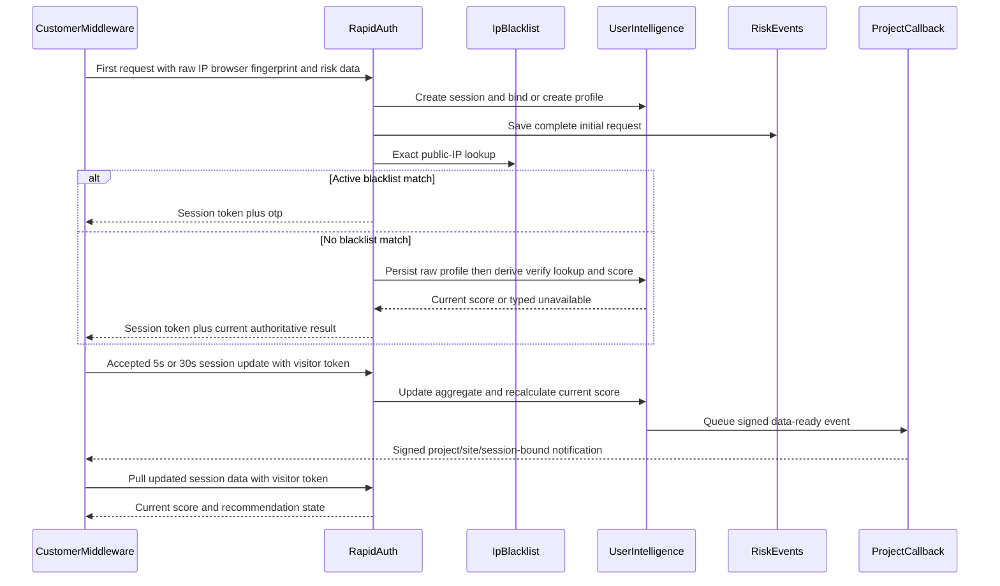

# BotBlocker Phase 17 — Proprietary scoring design plan

**Status: implementation in progress; fingerprint contracts/collector slice complete
(2026-08-17).** This document is the durable, repo-tracked result of
the Phase 17 design conversation. It does not claim that fingerprint collection, profile
aggregation, scoring, callback delivery, or rapid-server synchronization has shipped.

Ground truth for shipped behavior remains
[`POWEROTP_BOTBLOCKER_AS_BUILT.md`](POWEROTP_BOTBLOCKER_AS_BUILT.md). The canonical phase order
remains [`POWEROTP_BOTBLOCKER_DEVELOPMENT_PHASES.md`](POWEROTP_BOTBLOCKER_DEVELOPMENT_PHASES.md).
The product specification remains [`POWEROTP_BOTBLOCKER_PLAN.md`](POWEROTP_BOTBLOCKER_PLAN.md).

## Corrections made during this design session

Earlier phase documents and implementations contain AI-authored assumptions the user did not
approve. Phase 17 must correct them rather than build on them:

1. **Fingerprint evidence is separate from behavior evidence.** Route/click/mouse/scroll/honeypot
   reports are behavior data, not the browser fingerprint. BotBlocker must collect a broad,
   bounded browser/device fingerprint vector including active rendering signals.
2. **Inbound fingerprint hashing is wrong.** Phase 15 HMACs incoming evidence before the raw
   profile write. No inbound fingerprint or IP value is hashed in the target design. During
   `userIntelligence` creation/update, the server writes the approved stable-source fields and
   derives the single versioned verify lookup hash from those row values.
3. **Matching is exact, not fuzzy or closest-match.** A valid authoritative binding wins first;
   the home API may otherwise compare the raw fingerprint exactly. Verify servers may use the
   published user-row-derived hash as their primary edge lookup. An exact IP by itself never
   merges profiles and is used only as a risk/correlation input.
4. **No separate confidence model exists.** The current profile score is calculated from
   operator-selected profile fields. Missing fields are excluded from the calculation.
5. **Gate-session synchronization is fixed and schema-driven.** Selected fingerprint fields use
   latest-successful replacement, IP evidence uses current-value and bounded unique-LRU rules,
   and exact-IP reuse uses rolling distinct-profile counts. This is not an operator-authored
   conversion-formula layer. The separate `riskEvents` behavior reducer remains deferred until
   its fields and aggregation semantics are explicitly designed.
6. **No score-model/input version is stored.** Scoring configuration is live operator
   configuration. Browser fingerprint contracts and hash recipes remain versioned because those
   are client/sensor compatibility boundaries.
7. **No Phase 17 global allow/OTP threshold exists.** Phase 17 produces a `0..100` score. Phase 18
   owns customer-configured score sensitivity and OTP-type policy.
8. **CGNAT is not observable as a visitor-private address.** POWEROTP sees the public source IP.
   CGNAT is removed as a direct signal. IPv4 and IPv6 remain separate fast lookup/storage paths,
   not risk-score inputs merely because of address family.
9. **The callback is project-specific, not platform-global or BotBlocker-only.** Each project has
   its own callback URL and signing secret. A visitor session has its own scoped token. The
   existing project callback delivery mechanism must be extended for session-update
   notifications rather than creating another callback system.
10. **Session input retention is 90 days.** `gateSessions` and linked `riskEvents` form one
    logical session dataset but remain physically split to avoid unbounded MongoDB documents.
    Both use 90-day TTLs. The shared `fingerprintData` record and aggregated
    `userIntelligence` profile remain 18 months (548 days).
11. **The initial request is data, not a prelude to data.** Save its complete available trusted
    IP, browser/fingerprint, request, proof, and risk evidence as the session snapshot and initial
    immutable risk event before returning the first result.
12. **Session token and return identity have different scopes.** The visitor token authorizes one
    session for 30 minutes. At minute 29 middleware sends the refresh request and replaces its
    server-side bearer without changing identity; the signed persistent site-return cookie binds
    repeat visits to the same `userIntelligence` row and grants immediate local access while later
    updates may revoke access or require OTP.

## Identity and exact matching

Profile selection uses this precedence:

1. A valid signed persistent site-return cookie identifies its exact `userIntelligence` row.
2. An authoritative Passport binding identifies its exact row once Passport exists.
3. Without authoritative proof, the home API may identify a row by exact comparison of the saved
   raw fingerprint fields. No pre-persistence fingerprint hash is created for this path.
4. IP alone never identifies or merges a visitor profile.
5. No fuzzy score, nearest-neighbor search, partial fingerprint comparison, or IP-subnet identity
   match exists.

After the selected profile and raw fingerprint/profile writes have committed, derive the
versioned verify lookup hash. When a later accepted session produces a different value, replace
the row's current verify lookup field and retain no aliases. Raw fingerprint component evidence
remains available on the Mongo master for home lookup, profile updates, and security analysis.

## Browser fingerprint collection

Use exactly `@fingerprintjs/fingerprintjs` v5.2.0, pinned rather than ranged, as a component
collector. Initialize it with `monitoring: false` and run its expensive probes once per newly
created gate session. POWEROTP owns the wire/storage contract and maps the library output into
closed, bounded, versioned schemas. POWEROTP discards the library `visitorId` and confidence
result, and maps collector failures to bounded typed availability rather than retaining arbitrary
error objects.

Collect available values from:

- UA Client Hints and browser/OS family, version, platform, architecture, bitness, mobile/model;
- screen/frame dimensions, color depth, pixel ratio, device memory, hardware concurrency, and
  touch capability;
- languages, locale, timezone, and offset;
- canvas, WebGL basics/extensions/rendering, AudioContext, fonts, and font preferences;
- supported storage, cookies, media/browser APIs, PDF viewing, color gamut/HDR, and relevant
  accessibility/privacy capability outputs;
- automation/privacy indicators such as webdriver, Global Privacy Control, and Do Not Track when
  exposed.

Unavailable or browser-restricted components remain explicitly absent; they are never fabricated.
Arbitrary DOM/page content, form values, passwords, raw keystrokes, clicked text, and chronological
pointer trails remain prohibited because they are neither fingerprint nor approved behavior data.

### User-row verify lookup subset

During `userIntelligence` creation/update, write and then canonicalize/HMAC the comparatively
stable verify lookup subset from that row:

- platform family plus CPU architecture/bitness and mobile model when available;
- hardware concurrency, coarsened device memory, and maximum touch points;
- stable display/device-class properties, excluding frequently changing window/frame geometry;
- WebGL vendor/renderer, bounded capability signature, and deterministic render digest;
- deterministic canvas, AudioContext, and font/font-preference digests;
- browser vendor/family without the frequently changing full version.

Exclude IP, routes, behavior observations, browser/OS full versions, timezone, locale/language
order, exact window/frame dimensions, privacy preferences, storage state, and changing API
availability from the exact HMAC. Retain those collected components separately.

The server performs canonicalization and HMAC derivation using
`BOTBLOCKER_INTELLIGENCE_HASH_SECRET` and stores the single versioned result on
the same `userIntelligence` row for later edge publication. The input comes from that row rather
than directly from the inbound payload or `fingerprintData`. Browser-supplied hashes and visitor
IDs are never authoritative, and no other fingerprint-derived hash is retained.

## Session data and profile synchronization

`gateSessions` remains the small session header. The complete initial middleware request is saved
as its session snapshot and first immutable `riskEvents` row; later accepted behavior reports and
risk signals append linked events. Both are one logical session dataset and expire after 90 days.
This preserves indexed idempotency/order checks and avoids MongoDB's 16 MB document limit.

The approved gate-session synchronization design is now durable in
[`POWEROTP_BOTBLOCKER_PHASE17A_SESSION_INPUT_REDUCER_PLAN.md`](POWEROTP_BOTBLOCKER_PHASE17A_SESSION_INPUT_REDUCER_PLAN.md).
Despite that historical filename, it does not design the separate `riskEvents` reducer.

The complete bounded FingerprintJS vector lives in the shared platform-level `fingerprintData`
collection, with one current record per `userIntelligence` row and 548-day retention. A newer
accepted gate session replaces that current vector; the system does not create fingerprint rows
at five- or 30-second report cadence and retains no historical hash aliases. Only these
latest-successful values are copied to the hot `userIntelligence` row under the same field names:
`osCpu`, `screenResolution.width`, `screenResolution.height`, `platform`,
`touchSupport.maxTouchPoints`, `touchSupport.touchEvent`, `touchSupport.touchStart`, `vendor`,
`architecture`, and `applePay`. An unavailable newer component leaves the last successful
profile value unchanged. The row separately retains the bounded internal stable-source fields
used by the verify recipe; those are not additional operator scoring fields and do not duplicate
the complete fingerprint vector.

`userIntelligence` also gains the current exact trusted IP with that observation's optional
configured ASN score and explicit exact-IP blacklist result, plus a unique LRU of at most 20
prior IP entries carrying those same values. The current IP is excluded from prior-IP aggregates.
Maintain separate distinct-profile counts for that exact current IP across all websites and on
the same website over 1, 7, and 30 days. IP history is risk evidence only; it never identifies,
merges, automatically flags, or blacklists a profile.

Apply this synchronization at most once per accepted gate session. Create the session snapshot
and initial risk event, bind or create `userIntelligence`, and update the linked raw
`fingerprintData` and profile rows. During profile creation/update, derive the verify lookup field
from the stable-source values written to that row before scoring, callbacks, or returning the
initial result. Issue the 30-minute visitor token after the session row exists, persist only token
ID/expiry/digest metadata there, and write the bearer to the middleware's server-side gate
session. At minute 29 the middleware sends the refresh request, POWEROTP updates safe durable
metadata, and the middleware replaces its bearer without changing the session or profile binding.
Server observation time orders competing sessions, with
`gateSessionId` as the deterministic equal-time tie-breaker. Exact replay is a no-op, stale
sessions cannot overwrite newer direct values, concurrent IP changes cannot lose an accepted
update, and database failure leaves no partial raw synchronization.

Writing the initial risk event is required now. Only the detailed later `riskEvents`
behavior/risk-to-profile mapping remains deferred to a dedicated design and implementation
session. It must explicitly map routes/pages, click categories and normalized positions, mouse
and scroll aggregates, honeypots, page timing/dimensions, pointer heatmaps, navigation targets,
automation indicators, and risk-event kinds. Missing fields from that future updater do not block
scoring; the evaluator uses present fields and omits unavailable inputs.

External IP-reputation fields are also deferred. FingerprintJS supplies none. The current
gate-session synchronizer uses trusted middleware IP, local network/ASN resolution, and the
explicit exact-IP blacklist observation, but does not copy vendor-cache payloads into
`userIntelligence`. A later session must select the real vendor, approve bounded profile fields,
keep raw vendor payloads in the vendor cache, and register only approved fields for scoring.

## Profile scoring configuration

Profile scoring is a second, separate operator-admin configuration:

- one approved registry row per scoreable `userIntelligence` field;
- `enabled` toggle;
- restricted, validated mathematical expression converting the current field value to a finite
  `0..100` field result;
- separate nonnegative field weight;
- one restricted final-total expression over aggregate values such as weighted sum, present
  weight sum, and present-field count;
- no arbitrary JavaScript, `eval`, database access, network access, or dynamic property access.

Missing fields are excluded from both the aggregate and its denominator. Configuration starts
unconfigured; until at least one enabled field has usable evidence and the final expression is
valid, score status is typed unavailable rather than a fabricated zero or neutral score.

Configuration changes do not trigger a backfill job. The next accepted session update recalculates
the row's one current score using its current aggregate values and the then-current configuration.
No historical scores or score-model versions are stored.

## Runtime behavior

The first request awaits session creation, complete initial-event persistence, token metadata
write, and blacklist/profile resolution within the existing customer-selected 50–2,000 ms
timeout. A blacklist match remains an immediate real `otp` recommendation. Without a blacklist
match, Phase 17 supplies the current risk score. Phase 18 applies customer sensitivity/OTP-type
policy to that score; Phase 17 must not invent that policy. A valid signed site-return cookie may
grant immediate local access before this work completes, but the active session still starts and
later authoritative updates may revoke that access or require OTP.

Later accepted reports recalculate the profile and enqueue a small signed data-ready callback.
The callback is advisory notification, not visitor authorization: customer middleware verifies
the project callback signature and binding, then pulls authoritative session data using that
visitor session's scoped token. Existing bounded retry/idempotency/SSRF protections and polling
fallback patterns are reused. At minute 29 middleware sends the active token refresh request and
writes the rotated bearer back to its own server-side gate session while preserving its session
ID and `userIntelligence` binding.

Local middleware/browser headless detection may publish an immediate advisory recommendation for
customer code. It never opens OTP, alters customer content, or becomes browser-supplied decision
authority.

## Rapid/verify server publication

The Mongo master owns full `userIntelligence` profiles. Future Phase 26/27 edge publication keeps
at least 30 days of current versioned verify lookup mappings, exact-IP intelligence, and current
profile scores on verify servers. Verify is the primary rapid lookup when available. Any verify
unavailability or unresolved lookup falls back to the home API and authoritative Mongo
`userIntelligence` lookup. This plan defines the source data but does not deploy
`verify.powerotp.com` or invent a temporary synchronization consumer.

## Explicit exclusions

- No customer threshold/OTP-type slider implementation (Phase 18).
- No OTP iframe/challenge orchestration (Phase 19).
- No Passport/PaidTokenPass implementation or blacklist bypass.
- No real external IP-reputation vendor integration.
- No Cloudflare/verify server deployment or synchronization job (Phase 26/27).
- No fuzzy fingerprint matching, IP-only identity matching, CGNAT-private-address detection, or
  IPv4-versus-IPv6 risk weighting.
- No invented session-input conversion formulas or seeded score formulas/weights.

## Execution breakdown

The approved Phase 17A design is complete and implementation has started. Execute the remaining
work in dependency-ordered fresh sessions:

1. **Status: complete (2026-08-17). Fingerprint contracts and collector.** Added the exact pinned
   FingerprintJS dependency, monitoring-disabled once-per-new-session collection, bounded
   versioned POWEROTP contracts, typed component availability, initial authenticated bridge
   transport, and prohibited-data tests. See
   [`POWEROTP_BOTBLOCKER_AS_BUILT.md`](POWEROTP_BOTBLOCKER_AS_BUILT.md).
2. **Initial session persistence and durable identity binding.** Save the full first request as
   session plus initial risk event, implement the user-intelligence-bound site-return cookie,
   store safe visitor-token metadata, have middleware request and store the rotated bearer at
   minute 29, and preserve revocation/OTP updates.
3. **`fingerprintData` persistence and verify lookup field.** Add the shared
   one-record-per-profile raw collection, bounded stable-source fields on `userIntelligence`,
   same-row creation/update HMAC derivation, replacement/no-alias semantics, retention, and
   concurrency tests. Do not add inbound hash matching.
4. **Gate-session profile synchronization and IP evidence.** Add explicit blacklist observation,
   selected latest-successful fingerprint fields, current IP, the 20-entry unique prior-IP LRU,
   global/same-site rolling counts, and transactional at-most-once application.
5. **Scoring configuration/runtime.** Add the approved field registry, restricted validated math,
   nonnegative weights, final formula, present-field evaluation, current-score replacement, and
   typed-unavailable behavior without invented defaults.
6. **Project callback/pull.** Extend the existing signed project callback and scoped-token pull
   boundary after committed profile/score updates.
7. **Deferred `riskEvents` reducer.** Run its dedicated field-by-field design session before
   implementing behavior/risk profile mappings.
8. **Deferred external IP profile/scoring integration.** Select and confirm a real vendor first,
   approve its bounded fields, then append approved profile inputs and scoring registration.

Never begin a later subphase in the same fresh session. Never commit, push, deploy, populate
operator formulas, or activate customer traffic without explicit instruction.
