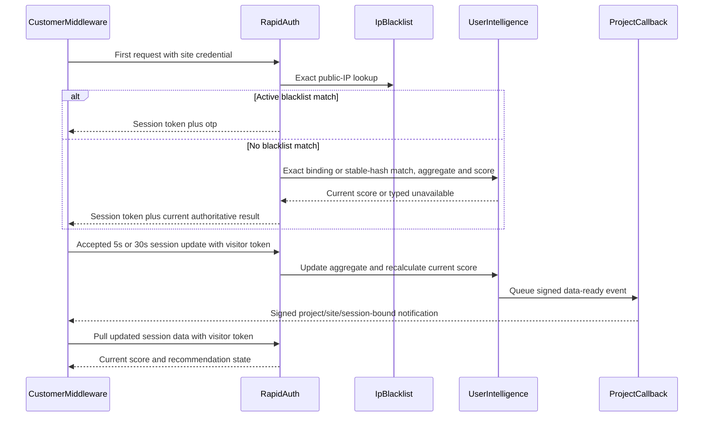

# BotBlocker Phase 17 — Proprietary scoring design plan

**Status: design only, not implemented.** This document is the durable, repo-tracked result of
the Phase 17 design conversation. It does not claim that fingerprint collection, profile
aggregation, scoring, callback delivery, or rapid-server synchronization has shipped.

Ground truth for shipped behavior remains
[`POWEROTP_BOTBLOCKER_AS_BUILT.md`](POWEROTP_BOTBLOCKER_AS_BUILT.md). The canonical phase order
remains [`POWEROTP_BOTBLOCKER_DEVELOPMENT_PHASES.md`](POWEROTP_BOTBLOCKER_DEVELOPMENT_PHASES.md).
The product specification remains [`POWEROTP_BOTBLOCKER_PLAN.md`](POWEROTP_BOTBLOCKER_PLAN.md).

## Corrections made during this design session

Earlier phase documents and implementations contain AI-authored assumptions the user did not
approve. Phase 17 must correct them rather than build on them:

1. **Fingerprint evidence is separate from behavior evidence.** Route/click/mouse/scroll/honeypot
   reports are behavior data, not the browser fingerprint. BotBlocker must collect a broad,
   bounded browser/device fingerprint vector including active rendering signals.
2. **The current fingerprint hash is wrong.** Phase 15 HMACs the entire changing
   `BrowserEvidence` report. The replacement hash is derived only from a selected stable subset
   of the new fingerprint vector.
3. **Matching is exact, not fuzzy or closest-match.** A valid authoritative binding wins first;
   otherwise an exact stable-fingerprint HMAC may match. An exact IP by itself never merges
   profiles and is used only as a risk/correlation input.
4. **No separate confidence model exists.** The current profile score is calculated from
   operator-selected profile fields. Missing fields are excluded from the calculation.
5. **No mathematical time-decay curve exists.** Numeric profile fields use cumulative running
   averages, so newer observations dilute older observations. Direct fields update directly.
   Elapsed time alone does not change an average.
6. **No score-model/input version is stored.** Scoring configuration is live operator
   configuration. Browser fingerprint contracts and hash recipes remain versioned because those
   are client/sensor compatibility boundaries.
7. **No Phase 17 global allow/OTP threshold exists.** Phase 17 produces a `0..100` score. Phase 18
   owns customer-configured score sensitivity and OTP-type policy.
8. **CGNAT is not observable as a visitor-private address.** POWEROTP sees the public source IP.
   CGNAT is removed as a direct signal. IPv4 and IPv6 remain separate fast lookup/storage paths,
   not risk-score inputs merely because of address family.
9. **The callback is project-specific, not platform-global or BotBlocker-only.** Each project has
   its own callback URL and signing secret. A visitor session has its own scoped token. The
   existing project callback delivery mechanism must be extended for session-update
   notifications rather than creating another callback system.
10. **Session input retention is 90 days.** `gateSessions` and linked `riskEvents` form one
    logical session dataset but remain physically split to avoid unbounded MongoDB documents.
    Both use 90-day TTLs. The aggregated `userIntelligence` profile remains 18 months (548 days).

## Identity and exact matching

Profile selection uses this precedence:

1. A valid existing server-held session/cookie binding identifies its exact
   `userIntelligence` row.
2. A future authoritative Passport binding identifies its exact row once Passport exists.
3. Without authoritative proof, an exact match on the server-derived stable fingerprint HMAC may
   identify a row.
4. IP alone never identifies or merges a visitor profile.
5. No fuzzy score, nearest-neighbor search, partial fingerprint comparison, or IP-subnet identity
   match exists.

When authoritative proof identifies a row and the newly collected stable fingerprint produces a
different HMAC, replace the row's current fingerprint HMAC. Do not retain hash aliases. Raw
fingerprint component evidence remains available on the Mongo master for profile updates and
security analysis.

## Browser fingerprint collection

Use a pinned FingerprintJS v5 release as a component collector. POWEROTP owns the wire/storage
contract and maps the library output into closed, bounded, versioned schemas. POWEROTP does not
trust or persist FingerprintJS's client-generated visitor ID as identity authority.

Collect available values from:

- UA Client Hints and browser/OS family, version, platform, architecture, bitness, mobile/model;
- screen/frame dimensions, color depth, pixel ratio, device memory, hardware concurrency, and
  touch capability;
- languages, locale, timezone, and offset;
- canvas, WebGL basics/extensions/rendering, AudioContext, fonts, and font preferences;
- supported storage, cookies, media/browser APIs, PDF viewing, color gamut/HDR, and relevant
  accessibility/privacy capability outputs;
- automation/privacy indicators such as webdriver, Global Privacy Control, and Do Not Track when
  exposed.

Unavailable or browser-restricted components remain explicitly absent; they are never fabricated.
Arbitrary DOM/page content, form values, passwords, raw keystrokes, clicked text, and chronological
pointer trails remain prohibited because they are neither fingerprint nor approved behavior data.

### Stable exact-hash subset

Canonicalize and HMAC only the comparatively stable identifying subset:

- platform family plus CPU architecture/bitness and mobile model when available;
- hardware concurrency, coarsened device memory, and maximum touch points;
- stable display/device-class properties, excluding frequently changing window/frame geometry;
- WebGL vendor/renderer, bounded capability signature, and deterministic render digest;
- deterministic canvas, AudioContext, and font/font-preference digests;
- browser vendor/family without the frequently changing full version.

Exclude IP, routes, behavior observations, browser/OS full versions, timezone, locale/language
order, exact window/frame dimensions, privacy preferences, storage state, and changing API
availability from the exact HMAC. Retain those collected components separately.

The server performs canonicalization and HMAC derivation using
`BOTBLOCKER_INTELLIGENCE_HASH_SECRET`. Browser-supplied hashes and visitor IDs are never
authoritative.

## Session data and profile aggregation

`gateSessions` remains the small session header. Immutable accepted behavior reports and risk
signals remain linked `riskEvents` documents. Both are one logical session dataset and expire
after 90 days. This preserves indexed idempotency/order checks and avoids MongoDB's 16 MB document
limit.

`userIntelligence` remains the 18-month aggregated profile and gains:

- the versioned latest broad fingerprint vector and current stable fingerprint HMAC;
- current direct fields, such as the latest observed display/browser properties;
- numeric running averages with the observation count needed for deterministic updates;
- exact IP observations;
- distinct system-wide exact-IP profile counts for the latest 1, 7, and 30 days;
- distinct same-site exact-IP profile counts for the latest 1, 7, and 30 days;
- the current `0..100` risk score and score availability status.

For a numeric observation:

`newAverage = ((oldAverage * oldCount) + newValue) / (oldCount + 1)`

No prior profile scores or calculated score contributions are retained. The existing immutable
session inputs remain available for the 90-day session-history period, but profile scoring uses
the current aggregate row.

## Deferred design: session input to user-intelligence updates

Before implementing profile aggregation, run one dedicated fresh design session that inventories
the exact current and new `behavior_report`/`risk_signal` inputs. That session must define:

- the approved source fields and target `userIntelligence` fields;
- whether each target is a running average, incrementing count, direct replacement, or unique
  exact-value observation;
- the operator admin configuration required to convert accepted session input into each profile
  update;
- whether and how one conversion may combine multiple values from the same accepted report;
- finite-value, range, overflow, division-by-zero, and missing-input behavior;
- atomic sequence/idempotency semantics proving stale/replayed reports cannot update a profile
  twice.

Do not invent this formula mapping in implementation. Save its approved design as a Phase 17
subplan before writing the reducer.

## Profile scoring configuration

Profile scoring is a second, separate operator-admin configuration:

- one approved registry row per scoreable `userIntelligence` field;
- `enabled` toggle;
- restricted, validated mathematical expression converting the current field value to a finite
  `0..100` field result;
- separate nonnegative field weight;
- one restricted final-total expression over aggregate values such as weighted sum, present
  weight sum, and present-field count;
- no arbitrary JavaScript, `eval`, database access, network access, or dynamic property access.

Missing fields are excluded from both the aggregate and its denominator. Configuration starts
unconfigured; until at least one enabled field has usable evidence and the final expression is
valid, score status is typed unavailable rather than a fabricated zero or neutral score.

Configuration changes do not trigger a backfill job. The next accepted session update recalculates
the row's one current score using its current aggregate values and the then-current configuration.
No historical scores or score-model versions are stored.

## Runtime behavior

The first request awaits session creation and blacklist/profile resolution within the existing
customer-selected 50–2,000 ms timeout. A blacklist match remains an immediate real `otp`
recommendation. Without a blacklist match, Phase 17 supplies the current risk score. Phase 18
applies customer sensitivity/OTP-type policy to that score; Phase 17 must not invent that policy.

Later accepted reports recalculate the profile and enqueue a small signed data-ready callback.
The callback is advisory notification, not visitor authorization: customer middleware verifies
the project callback signature and binding, then pulls authoritative session data using that
visitor session's scoped token. Existing bounded retry/idempotency/SSRF protections and polling
fallback patterns are reused.

Local middleware/browser headless detection may publish an immediate advisory recommendation for
customer code. It never opens OTP, alters customer content, or becomes browser-supplied decision
authority.

## Rapid/verify server publication

The Mongo master owns full `userIntelligence` profiles. Future Phase 26/27 edge publication keeps
at least 30 days of current exact fingerprint HMAC mappings, exact-IP intelligence, and current
profile scores on verify servers. This plan defines the source data but does not deploy
`verify.powerotp.com` or invent a temporary synchronization consumer.

## Explicit exclusions

- No customer threshold/OTP-type slider implementation (Phase 18).
- No OTP iframe/challenge orchestration (Phase 19).
- No Passport/PaidTokenPass implementation or blacklist bypass.
- No real external IP-reputation vendor integration.
- No Cloudflare/verify server deployment or synchronization job (Phase 26/27).
- No fuzzy fingerprint matching, IP-only identity matching, CGNAT-private-address detection, or
  IPv4-versus-IPv6 risk weighting.
- No invented session-input conversion formulas or seeded score formulas/weights.

## Execution breakdown

Phase 17 exceeds one fresh-session unit and must be split before implementation:

1. **17A — Session-input reducer design.** Inventory actual report/risk shapes; approve and save
   the session-input-to-profile admin formula/aggregation subplan.
2. **17B — Fingerprint contracts and sensor.** Add pinned FingerprintJS component collection,
   POWEROTP-owned bounded contracts, stable canonical HMAC derivation, and exact matching changes.
3. **17C — Retention and profile aggregation.** Apply 90-day session-input TTLs, expand
   `userIntelligence`, add exact global/site IP reuse counts, and implement the approved reducer.
4. **17D — Scoring configuration and admin UI.** Add the safe expression configuration,
   per-field enable/weight controls, final formula, validation, and typed-unavailable readiness.
5. **17E — Runtime scoring.** Recalculate on every accepted update and return the initial current
   score after blacklist precedence within the existing timeout behavior.
6. **17F — Project callback updates.** Extend the existing per-project signed callback queue and
   adapter receiver/pull flow for idempotent session-data-ready events.
7. **17G — Closing verification and documentation.** Run focused verification per touched
   workspace, update the as-built log only for work actually shipped, and correct this execution
   list's statuses.

Never begin a later subphase in the same fresh session. Never commit, push, deploy, populate
operator formulas, or activate customer traffic without explicit instruction.
