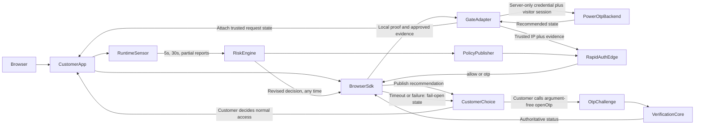

# PowerOTP BotBlocker Development Plan

Last updated: 2026-08-17 (locked the state-publication-only integration boundary, bounded
fingerprint persistence/gate-session synchronization, and callback-first OTP status; execution remains governed by
[`POWEROTP_BOTBLOCKER_DEVELOPMENT_PHASES.md`](POWEROTP_BOTBLOCKER_DEVELOPMENT_PHASES.md))

Execution is split into small, dependency-ordered fresh-session phases in
[`POWEROTP_BOTBLOCKER_DEVELOPMENT_PHASES.md`](POWEROTP_BOTBLOCKER_DEVELOPMENT_PHASES.md).
That document is the implementation sequence and handoff rule; this document remains the
product and architecture specification.

## Purpose

PowerOTP BotBlocker is the primary PowerOTP product: a centrally managed bot-risk and
fraud-intelligence plugin installed additively in a customer's own website or request path.
The server adapter gathers trusted request data, communicates server-to-server with POWEROTP
using the customer's server-only site credential for initial session creation and narrow
server-held tokens thereafter, and publishes the resulting recommended website state through
the browser SDK. That publication is the complete integration boundary: POWEROTP does not
enforce the recommendation and does not require, assume, or verify any customer response to it.
Customer code alone decides whether and how to use the state. POWEROTP never rewrites the
customer's application code.

The customer mounts the credential-free browser state provider once at its application root so
its own code can read current state. The provider never blocks, hides, replaces, branches, or
renders customer content. The assessment fast path is ordered: first verify a site-specific
return clearance locally; otherwise discover and validate an installed POWEROTP Passport with
POWEROTP and mint a pairwise assertion for this site; only when neither proof is valid does the
adapter combine approved initial browser evidence with trusted IP/request context for RapidAuth.
POWEROTP returns exactly one of two decisions:

- `allow`: recommend normal access and continuously observe.
- `otp`: report an OTP recommendation and make the single argument-free `gate.openOtp()` API
  available for customer code to call explicitly if it chooses.

The customer chooses a decision timeout between 50 and 2,000 ms, 200 ms recommended. If the
timeout or a RapidAuth failure occurs first, the SDK publishes a fail-open access
recommendation. That lifecycle transition is not a fabricated backend `allow`: the pending
decision continues, and a verified late `otp` still replaces the current recommendation. A
blacklist match produces `otp`, never permanent denial.

**State-only boundary, stated plainly:** POWEROTP publishes a recommendation and nothing more.
The adapter/provider never blocks a handler, suppresses SSR, changes a route, alters a response,
branches customer rendering, or calls `openOtp()` automatically. Labels such as `restricted`,
`full_access`, and `otp_required` describe the recommendation only; they are not UI modes that
POWEROTP applies. Customer code may use or ignore the state under its own policy.

The existing OTP platform is the recovery and confidence mechanism: BotBlocker's `otp`
decision authorizes the same hosted challenge/iframe surface. Customer code makes one
argument-free `gate.openOtp()` call; POWEROTP selects the iframe's OTP method, content, and
policy server-side from the authenticated site/session decision and returns only short-lived
launch metadata. The site credential authenticates the first RapidAuth contact; POWEROTP then
returns a short-lived token bound to site, gate session, audience, expiry, and revocation, which
the customer adapter stores server-side. The empty same-origin opener request carries the
HttpOnly local gate-session cookie; the adapter resolves its server session and forwards only
that scoped token to POWEROTP. POWEROTP maps the token's gate session to the internal
user-intelligence record. Neither the session ID nor public site ID is authorization.
This BotBlocker opener is separate from ordinary customer-initiated OTP API flows such as
signup or password recovery. Those APIs use their own customer request/configuration; they do
not turn BotBlocker recommendations into customer-authored screens or caller-selected
BotBlocker iframe content.
BotBlocker's evaluation combines fast signed-clearance checks, local IP intelligence, browser
consistency, decoy interactions, request velocity, and continuous post-load behavior.
Ambiguous or high-risk traffic receives an OTP recommendation rather than permanent denial,
and a previous `allow` or clearance may be revised to `otp`.

## Product invariants

- The Gate Adapter runs in the customer's own request path, gathers trusted data, performs
  initial RapidAuth/session creation with the server-only site credential, uses narrow
  server-held visitor tokens for later calls, and attaches the recommended state. It never
  blocks, rewrites, replaces, or consumes the customer's response itself. The installed
  provider reports state only; no generated or supported integration enforces it.
- A fresh signed site clearance is verified locally with a target of approximately 1 ms.
- A new-visitor RapidAuth decision targets less than 50 ms added latency from a nearby warm
  edge; this is a target, not a universal network guarantee, and it is independent of the
  customer-configured 50–2,000 ms advisory timeout described above.
- The decision is exactly one of two values, `allow` or `otp`. There is no third "deny" or
  "block" outcome. `checking`, fail-open, and unavailable are lifecycle states, not fabricated
  decisions.
- Website-facing recommendations are derived state, not additional decisions:
  - `checking` publishes the `restricted` recommendation label.
  - verified `allow`, timeout fail-open, or unavailable fail-open publishes `full_access`.
  - verified `otp` publishes `otp_required` and exposes explicit `gate.openOtp()`.
  - authoritative OTP success publishes `full_access`.
  These labels never cause POWEROTP code to alter customer content or access.
- Every visitor is reassessed continuously, not just once: an initial browser/behavior report
  five seconds after load, recurring reports every 30 seconds, and partial reports on route
  navigation, page hide, close, or site exit. Every accepted report is saved to the visitor's
  session. Approved profile updaters synchronize their available fields before scoring is rerun;
  a missing or not-yet-mapped field is omitted and never blocks the entire score. Any update may
  revise a prior `allow` or valid clearance to `otp`. If the profile is identity-bound, the
  same authoritative risk change may suspend its Passport or paid-agent fast path until the
  server-defined OTP/recovery requirement succeeds; browser middleware reports evidence but
  never authors that decision.
- When customer code calls `gate.openOtp()`, monitoring pauses while the iframe is open and
  resumes in a fresh interval only after authoritative OTP success.
- Customer traffic stays on the customer's hosting platform. PowerOTP receives decision
  metadata, challenge traffic, summarized/sanitized risk events, and optional agent-access
  traffic — never the customer's page content.
- Collected behavior evidence is sanitized at the source: route path without query string or
  fragment; explicit page ID/name; page active/total time and navigation targets; click element
  category, explicit `data-powerotp-id`, and normalized page position (never clicked text,
  form values, or raw pixel coordinates); sparse client-aggregated 32×32 pointer heatmap bins
  and mouse-directness metrics (never chronological pointer trails); scroll smoothness and
  high-speed aggregates (never raw scroll trails); and honeypot activations. Raw keystrokes,
  passwords, emails, DOM snapshots, page content, automatically scraped document titles, and
  arbitrary CSS selectors are never collected. The backend derives an absolute query-free page
  URL from the authenticated audience plus sanitized route so a later customer heatmap viewer
  can open the page and render an aggregate overlay.
- PowerOTP owns risk weights, thresholds, threat feeds, challenge logic, and sensor cadence.
- Advisory state is attached to every customer application request except fixed owned,
  infrastructure, static, health, `OPTIONS`, and WebSocket exclusions. Customers select
  purchased OTP methods, optional POWEROTP-hosted CleanDataPages for agent access, the decision
  timeout (50–2,000 ms, 200 ms default), and emergency behavior in their own code.
- Customers cannot choose the OTP method/content at iframe-open time. The single
  `gate.openOtp()` call accepts no method, policy, or challenge-content arguments; POWEROTP
  resolves the session's configured method server-side.
- The browser never supplies an API key, gate-session ID, site ID, user-intelligence ID, or OTP
  selection to `openOtp()`. Its empty same-origin request is bound by the HttpOnly session
  cookie; the server adapter retrieves its stored scoped gate-session token.
- Within the per-visitor flow, the site credential authenticates initial RapidAuth/session
  creation; separately authorized site-level configuration operations may still use it. The
  resulting short-lived gate-session token authorizes only that visitor's approved
  launch/status operations, is site/session/audience-bound and revocable, and remains
  server-side. It is sufficient for `openOtp()` without resending the broader site credential.
- Every visit has its own gate-session ID and every project-scoped profile has a
  server-generated user-intelligence ID. That intelligence profile is the visitor's continuing
  behavior/risk record whether it is still anonymous or later associated with a POWEROTP user.
  An authoritative account identification (for example verified email login, Human Passport,
  or Agent Passport/PaidTokenPass ownership) creates an internal `identityBindings` association
  rather than trusting a browser-supplied identity. The binding lets behavior intelligence
  govern that user's Passport/paid-access risk state while keeping the externally exposed
  project visitor ID pseudonymous.
- Supabase Enterprise is the intended ISO 27001-scoped system of record for user account and
  identity data. Email, password/authentication hashes, verified attributes, and other PII live
  there; MongoDB stores BotBlocker intelligence plus only an opaque/keyed internal identity
  reference in `identityBindings`, never those account fields or a customer-visible global user
  ID.
- No single weak IP, browser, behavioral, or decoy signal is treated as certain proof.
- Elevated risk surfaces OTP; it does not create an unrecoverable permanent denial.
- OTP proves access to a phone channel, not legal identity.
- Negative reputation is server-side state. A bot can delete a cookie, so a “blocked cookie”
  is not enforcement.
- PowerOTP may correlate pseudonymous fraud/security evidence across protected sites
  internally (see [Risk Engine and Reputation Store](#risk-engine-and-reputation-store)).
  A customer may query only observations belonging to its own project(s) — never another
  site's visitor history or raw events.
- Passport and runtime telemetry are purpose-limited security data. The extension does not
  collect or sell browsing or shopping histories.
- Production and development never use fake threat data, fake scores, fake blacklist matches,
  fake Passport approvals, fake paid entitlements, or synthetic OTP success. Mocks are
  test-only. Unfinished subsystems return explicit typed unavailable responses, and BotBlocker
  stays disabled for real customers until the backing phases and end-to-end tests are
  complete — see
  [`POWEROTP_BOTBLOCKER_DEVELOPMENT_PHASES.md`](POWEROTP_BOTBLOCKER_DEVELOPMENT_PHASES.md).
- Deployment is DigitalOcean-first: every capability ships on the existing DigitalOcean App
  Platform control plane before any Cloudflare-global-edge implementation is built. Cloudflare
  Workers are a later, additive latency optimization (see
  [RapidAuth Global Edge](#rapidauth-global-edge)), never a launch dependency.

## System flow

POWEROTP publishes recommended website state through an additive plugin protocol. Publication
is the end of POWEROTP's authority over the customer application: customer code alone decides
whether and how to act, and the supported integration never enforces a response.



## Components

### Gate Adapter

A small platform-specific package installed in the customer's request path. It starts or
continues the visitor gate session, collects trusted request/IP context, communicates with
POWEROTP using the customer's server-only site credential for first contact and scoped
server-held tokens thereafter, attaches a recommendation snapshot to framework-native request
state, and lets the customer handler/response continue untouched. Customer plugin code is
free to consume or ignore the snapshot under customer-owned policy.

- Verifies PowerOTP Ed25519-signed clearances and signed policy locally.
- Extracts client IP only from platform-approved trusted proxy headers.
- Calls RapidAuth for a fresh decision when clearance is absent, expired,
  revocation-positive, or reassessment is required. The browser SDK publishes fail-open state
  after the configured 50–2,000 ms timeout without canceling the in-flight decision.
- Exposes bounded same-origin bridge routes for bootstrap, evidence, decision verification,
  challenge status, and the single `openOtp()` launch path. The opener accepts an empty body,
  resolves the HttpOnly local gate session, retrieves its server-held scoped token, and makes
  the upstream request without resending the site credential; it does not open UI
  automatically.
- Sets HttpOnly cookies without exposing credentials to browser JavaScript.
- Uses a signed last-known-good policy with bounded timeout behavior.
- Never downloads or executes arbitrary backend code.

Planned packages, each a thin wrapper over one shared protocol so no customer rewrites their
integration when a wrapper changes:

- `libraries/gate-core`: framework-neutral browser state machine and shared protocol logic.
- `libraries/gate-node`: dependency-free raw Node HTTP wrapper (`http.createServer` request
  listeners) for customers not using Express or Next.js.
- `libraries/gate-express`: Express middleware/router wrapper.
- `libraries/gate-next`: Next.js native `proxy.ts`/App Router wrapper.
- `backend/packages/contracts/src/botblocker.ts`: the versioned protocol contracts all three wrappers
  share — see [Phase 1](POWEROTP_BOTBLOCKER_DEVELOPMENT_PHASES.md#phase-1--base-protocol-contracts).

Reference TypeScript/Node/React installation (Express shown; the raw Node HTTP and Next.js
wrappers expose the same `siteId`/`siteCredential`/timeout options over their own idiomatic
APIs):

```typescript
import express from "express";
import { createPowerOtpBotBlocker } from "@powerotp/gate-express";

const app = express();
const botBlocker = createPowerOtpBotBlocker({
  siteId: process.env.POWEROTP_SITE_ID!,
  siteCredential: process.env.POWEROTP_SITE_CREDENTIAL!,
  audience: "https://customer.example",
  verificationKeys, // from the Signed Policy Client below; Phase 14A automates this
  decisionTimeoutMs: 200, // 50-2000, 200 recommended
});

app.use(botBlocker.middleware());
app.use(express.static("dist/client"));
app.use("/api", apiRouter);
app.get("/{*path}", renderReactApplication);
```

The middleware must precede static, SSR, and API handlers so it can attach trusted request
state and own `/_powerotp/*` bridge routes. It does not block those handlers, consume customer
bodies, or rewrite customer responses. Fixed technical exclusions are adapter-owned; there is
no selective-route enforcement callback. React integrations receive an additive provider/hook
that reports state without affecting rendering.

### Signed Policy Client

The installed adapter remains stable while centrally controlled behavior arrives as declarative signed data.

- Policy fields include version, activation, expiration, site audience, protocol compatibility, risk weights, challenge mapping, edge endpoints, sensor version, verification keys, dataset versions, and revocation-filter metadata.
- The adapter verifies Ed25519 signatures and schema before activation.
- It caches a last-known-good policy and rejects unauthorized rollback.
- Verification keys arrive through this same signed policy fetch, resolved from only the public
  `siteId` — not typed in by the customer. Phase 7 shipped the signed release and endpoint with a
  key-*ID* reference only; Phase 14A
  (see [`POWEROTP_BOTBLOCKER_DEVELOPMENT_PHASES.md`](POWEROTP_BOTBLOCKER_DEVELOPMENT_PHASES.md#phase-14a--automatic-verification-key-delivery))
  adds the real key material to the release and the adapter-side fetch client that consumes it,
  after which `verificationKeys` stops being a constructor value a customer supplies directly.
- The only visitor-facing decision values are `allow` and `otp`; policy fields such as
  `agent_access` eligibility or browser-check cadence configure *how* PowerOTP arrives at that
  decision, they never add a third outcome.
- Policy releases use canary rollout and signed rollback.

Customer adapters contain public verification keys, never PowerOTP signing secrets. Existing `backend/packages/api/src/interaction-tokens.ts` and `backend/packages/api/src/security.ts` provide useful security patterns, but BotBlocker clearance and policy use asymmetric signatures.

### RapidAuth Global Edge

`apps/rapid-auth-edge` will run on Cloudflare Workers. The DigitalOcean application remains the control plane.

- Verifies site, request freshness, nonce, and protocol.
- Uses compact signed snapshots for bogons, Spamhaus DROP, Tor, cloud/datacenter prefixes, ASN class, and licensed proxy/residential intelligence.
- Uses edge/runtime cache plus Cloudflare storage; MongoDB and synchronous third-party APIs are excluded from the hot path.
- Scores request consistency, prior session/Passport reputation, abuse, velocity, browser evidence, and decoy events.
- Returns a short-lived, site-bound signed decision.
- Queues summarized risk events asynchronously to the DigitalOcean control plane.
- External reputation APIs are asynchronous enrichment or high-risk cache-miss tools only.

### Risk Engine and Reputation Store

Add durable, decaying entities instead of one global bad-IP flag:

- `botblockerSites`
- `siteSessions`
- `deviceReputations`
- `networkReputations`
- `fingerprintData` (one current bounded full fingerprint vector per `userIntelligence` profile)
- `identityBindings` (authoritative association from one or more project-scoped
  `userIntelligence` profiles to an opaque/keyed internal user reference)
- `riskEvents`
- `policyReleases`
- `agentEntitlements`

Valkey handles short windows, rate limits, deduplication, challenge state, and event queues.
MongoDB remains durable risk/intelligence storage. Supabase Enterprise is the authoritative
account/identity store. POWEROTP creates an identity binding only after authoritative account,
Passport, or paid-entitlement verification; neither a customer ownership claim nor browser
telemetry can create it. The browser sensor never scrapes email, password, or form values.

### Tokens and cookies

- `powerotp_access`: 2–5 minute site clearance verified locally.
- `powerotp_site_return`: longer site credential used to request fresh clearance; it cannot override server revocation.
- Gate token: seconds-long, one-time, original-route-bound challenge state.
- Human Passport root: optional device-key-bound registration installed after a person completes
  a challenge and explicitly chooses persistent Passport access; valid for up to one year and
  revocable.
- Agent Passport root: a purchased proof-of-possession token installed in an automated browser,
  with paid scope/quota/expiry/revocation recorded by the PaidTokenPass entitlement ledger.
- Passport site assertion: one-time and site-bound for either Passport class. POWEROTP can
  recognize the Passport across all participating sites, but customer sites do not receive a
  network-global identifier.

Immediate remote revocation and zero lookups cannot both be guaranteed. Short access lifetime, fast edge refresh, and compact signed revocation filters provide the practical balance.

### Passport: install once, allow across participating sites

POWEROTP Passport is a persistent browser/device credential for returning access across every
participating POWEROTP-protected site. It has two holder classes under one product:

- **Human Passport.** A person completes a POWEROTP challenge, is verified, and explicitly
  chooses to install persistent Passport access in the browser. The Passport is bound to a
  device credential such as a passkey.
- **Agent Passport.** A bot or other automated client purchases an eligible Passport, installs
  its proof-of-possession token in its browser/runtime, and uses that credential to identify
  itself to POWEROTP across protected sites. PaidTokenPass is the internal entitlement,
  quota, and consumption ledger behind this Agent Passport; it is not presented to customers as
  an unrelated product identity.

Both classes validate through POWEROTP and produce the same customer-facing `allow` fast path.
Their internal proof types, issuance requirements, lifecycle controls, and abuse limits remain
separate so a purchased agent credential can never impersonate a verified human. Neither class
adds a third BotBlocker decision.

1. If the current site already has a valid signed return clearance, the adapter verifies it
   locally and immediately publishes full access.
2. Otherwise, the browser starts the POWEROTP Passport assertion flow. The customer site cannot
   read a POWEROTP cookie or credential from another origin, so POWEROTP validates the Passport
   server-side for credential class, device/proof-of-possession proof, status, paid entitlement
   where applicable, revocation, expiry, freshness, and replay.
3. POWEROTP returns a one-time assertion bound to the requesting site, audience, gate session,
   nonce, and expiry, using a pairwise site subject rather than a network-global customer-visible
   identifier. The adapter verifies the assertion, publishes `allow`/full access, and stores the
   resulting site clearance and scoped session authorization.
4. If no Passport exists or validation fails, the adapter continues to RapidAuth. Passport
   absence never fabricates `allow`, and Passport validation failure never exposes identity data
   to the customer site.

This delivers “install once, works everywhere” without an unreliable or privacy-invasive shared
cross-site cookie. New participating domains use a first-party POWEROTP assertion flow (including
an imperceptible top-level authorization round trip where browser policy requires it) to mint
their own pairwise first-party assertion. Customer sites can recognize only their own pairwise
visitor; POWEROTP alone may associate that Passport with its private cross-site security record.
The detailed passkey, top-level redirect, unlinkability, consent, and wallet-credential design is
canonical in
[`PASSPORT_BUSINESS_AND_LEGAL_PLAN.md`](PASSPORT_BUSINESS_AND_LEGAL_PLAN.md#4-passport-delivery-and-the-cookie-constraint).

Whichever path grants access—local site clearance, validated Passport, or RapidAuth `allow`—the
same continuous observation starts. The first behavior report is sent at five seconds, complete
intervals are sent every 30 seconds, and navigation/hide/close/exit sends a partial interval.
The browser sends no Passport root, global identity, site credential, or scoped visitor token.
The adapter resolves the HttpOnly local gate session and uses its server-held scoped token so
POWEROTP attaches each report to the correct site session, private human-or-agent
Passport/user-intelligence record when present, and project-scoped customer visit trail.

### Browser State SDK, OTP Opener, and Runtime Sensor

The credential-free browser SDK publishes current state and recommendation changes without
changing the customer's DOM itself. It does not place customer UI into any mode or prescribe a
rendering branch. Customer code alone decides whether and how to use the state. When state is
`otp`, customer code may explicitly call the one argument-free `gate.openOtp()` API.
POWEROTP then validates the site/session decision server-side and returns short-lived metadata
for the server-selected hosted iframe. The customer cannot select the OTP method or iframe
content in that call. Session continuity comes from the same-origin HttpOnly cookie, not a
caller-supplied identifier. The adapter retrieves the server-held scoped token minted by the
site-credential-authenticated first RapidAuth contact and forwards that token to POWEROTP.
POWEROTP resolves the gate session's internal user-intelligence relationship before selecting
iframe content. While an explicitly opened iframe is active, the runtime sensor pauses
customer-page observation and resumes a fresh interval only after authoritative success.

After an access recommendation, the runtime sensor:

- Aggregates trusted pointer, touch, keyboard, scroll timing, navigation velocity, repeated
  actions, and API velocity locally, then sanitizes it before sending:
  - Route path only, with query string and fragment stripped.
  - Click element category and an explicit `data-powerotp-id`, never clicked text or form
    values.
  - Mouse directness/straight-line metrics between clicks, never raw coordinate trails.
  - Scroll smoothness and high-speed aggregate metrics, never raw scroll trails.
  - Honeypot/decoy activations.
- Never transmits raw keystrokes, raw mouse trails, passwords, emails, DOM snapshots, page
  content, or arbitrary CSS selectors.
- Sends an initial report **five seconds** after load, recurring reports **every 30 seconds**,
  and a partial report whenever an interval is cut short by route navigation, page hide,
  close, or site exit. Every report is saved to the visitor's session and reruns scoring.
- Receives a fresh signed decision after every report; any of them may revise a prior `allow`
  or valid clearance to `otp` — reassessment is continuous, not one-shot.
- On a revised `otp`, publishes the new state immediately. Customer code decides whether to
  close its UI and invoke `gate.openOtp()`; POWEROTP never performs either action implicitly.
- Treats an AI/summary decoy activation as one centrally weighted risk signal, not permanent
  proof.

Behavior reports above are not the complete browser-fingerprint specification. BotBlocker also
collects a separate, versioned broad browser/device vector once per new gate session for later
server-side exact matching. Exactly pinned `@fingerprintjs/fingerprintjs` v5.2.0 runs with
monitoring disabled and is mapped into POWEROTP-owned, closed, bounded contracts. Its visitor ID
and confidence result are discarded; component failures become bounded typed availability rather
than arbitrary retained errors. Available components include UA Client Hints,
screen/device/hardware properties, platform/architecture, timezone/languages, supported browser
capabilities, WebGL, canvas, audio, and font outputs.

The complete current vector is retained for 548 days in the shared platform-level
`fingerprintData` collection, one record per `userIntelligence` profile. A newer accepted gate
session replaces the current vector; no five-/30-second fingerprint-document stream or historical
hash-alias list exists. The hot `userIntelligence` row receives only the approved selected
latest-successful fields: `osCpu`, screen width/height, `platform`, the three `touchSupport`
values, `vendor`, `architecture`, and `applePay`. An unavailable newer component leaves the last
successful selected profile value unchanged. Frequently changing components may remain useful
bounded evidence but are excluded from the exact lookup HMAC.

The server canonicalizes only the approved stable subset and derives one keyed exact HMAC; a
browser-provided fingerprint hash or library visitor ID is never accepted as authoritative
identity. A valid server-held session/cookie binding (and later an authoritative Passport
binding) selects its exact profile first; otherwise the exact stable HMAC may match. IP alone
never merges profiles. When authoritative proof sees a changed stable HMAC, the row's current
hash is replaced. There is no fuzzy, closest-match, partial-hash, subnet-identity, or IP-only
identity path. Cross-site correlation remains internal POWEROTP evidence and is never exposed as
a network-global customer identifier.

Cookie-derived evidence follows actual browser boundaries. Browser JavaScript cannot read
HttpOnly cookies or another origin's cookies. Arbitrary readable cookie values may be login or
session bearer credentials and therefore must not be copied into browser reports. A customer
may explicitly classify named, non-secret first-party cookies as matching inputs; the adapter
then sends them through a dedicated bounded path for server-side keyed derivation and does not
persist or expose the raw value. Cookie presence or a derived match is evidence only: unrelated
sites normally set unrelated values, browsers partition third-party state, and deletion or
rotation prevents cookie matching from being an enforcement mechanism.

Versioned immutable sensor assets are selected through signed policy.

Accepted gate-session inputs update the linked `userIntelligence` profile through fixed,
schema-driven synchronization, not an operator-authored conversion-formula layer. The profile
keeps the current exact trusted IP and a unique LRU of at most 20 prior IPs, each with that
observation's optional configured ASN score and explicit exact-IP blacklist result. It also keeps
separate system-wide and same-site distinct-profile counts for the current exact IP over 1, 7,
and 30 days. IP history is risk evidence only and never selects, merges, automatically flags, or
blacklists a profile.

Apply fingerprint/session synchronization at most once per accepted gate session in one MongoDB
transaction that validates full scope, conditionally marks the synchronization, updates the linked
`fingerprintData` and `userIntelligence` rows, and commits before score or callback use. Server
observation time plus a gate-session-ID tie-breaker prevents stale sessions from overwriting newer
direct fields; concurrent IP changes cannot lose an accepted update, and failure leaves no partial
state.

The detailed `riskEvents` behavior/risk reducer remains separately deferred until its field
mappings and aggregation semantics are approved. External IP-vendor profile fields likewise wait
for selection of a real vendor and approval of bounded fields; raw vendor payloads remain in the
vendor cache. Missing fields from either future updater do not block scoring. The separate
operator scoring layer enables approved present profile fields, applies validated restricted math
and nonnegative weights, then applies a validated final-total expression to produce the current
`0..100` risk score. Unconfigured scoring is typed unavailable. Only the current aggregate and
score are stored; score history and scoring-model versions are not.

`gateSessions` plus linked immutable `riskEvents` form one logical session dataset while remaining
physically split to avoid unbounded MongoDB documents. Both expire after 90 days.
`fingerprintData` and `userIntelligence` remain 548-day/18-month current records.

### OTP integration

Reuse the existing verification state machine, interaction-token protections, and callbacks.

- Add BotBlocker challenge orchestration with site/session/risk context.
- Implement the hosted challenge/widget route already anticipated by `libraries/widget-loader/src/index.ts`.
- Complete and production-test only the methods sold in the initial BotBlocker tier.
- Do not advertise unfinished `sms_code` or `voice_challenge`.
- Add challenge idempotency, timeout, retry, recovery, spend limits, number suppression, velocity limits, and abuse kill switches.
- Make signed customer callbacks the primary challenge-status delivery path. The project
  dashboard card shows the callback URL preconstructed from the project's verified origin:
  `https://customer.example/_powerotp/webhooks/challenge-status`. The public MCP generates that
  fixed adapter-owned route and its environment-variable instructions; session IDs, states,
  ciphertext, and secret material never appear in the URL path or query.
- Generate an independent 256-bit webhook signing secret per project and rotation version.
  Show the value once for placement in the customer's `POWEROTP_WEBHOOK_SIGNING_SECRET`
  environment variable, never display it again, and support explicit replacement/overlap
  rotation. Because POWEROTP must produce future HMAC signatures, the signing key cannot be
  stored only as a one-way hash: store it encrypted at rest under the existing secret-management
  boundary and store a separate hash/fingerprint for lookup and audit. Never return the
  recoverable value through ordinary project reads.
- Send bounded HTTPS JSON callback events containing an idempotent event ID, public project/site
  binding, opaque challenge ID, opaque/encrypted session reference, authoritative status,
  timestamp, expiry, and nonce. Sign the timestamp plus exact body in headers. The adapter
  verifies signature, site/session/challenge binding, freshness, nonce replay, and idempotency
  before updating its server-side gate session. Browser cookies do not authenticate this
  server-to-server callback.
- Callback delivery updates adapter state but cannot directly execute code in an already-open
  browser. A valid hosted-iframe UX `postMessage` prompts an immediate same-origin local status
  request; that request reads the callback-updated adapter session and still cannot treat the
  message itself as proof.
- Use authoritative upstream polling only as fallback when callback state has not arrived.
  Start the first fallback check two seconds after OTP completion/opening remains pending, then
  retry with bounded jittered backoff (2, 4, 8, then 15 seconds maximum) until terminal status,
  expiry, or cancellation. A fallback result passes the same site/session/challenge validation
  and loss-safe browser acknowledgement path as callback-delivered state.
- Retry failed callback deliveries with idempotency and bounded backoff. Multi-instance and
  serverless adapters require a shared concurrency-safe session store so either the callback or
  fallback poll can update the state read by the visitor's next local status request.
- Reuse the same per-project callback URL, signing secret, delivery queue, retry behavior, and
  adapter verification boundary for BotBlocker session-data-ready notifications. The callback
  carries only bounded project/site/session/event binding and tells middleware that authoritative
  data changed. After verifying it, middleware pulls the current session score/recommendation
  using that visitor session's scoped token. The callback itself is not decision authority.

### PowerOTP Passport

After OTP, offer an optional Passport.

- Implement a no-extension top-level `verify.powerotp.com` redirect fallback.
- Publish purpose-limited Chrome/Edge and Firefox extensions after protocol review; Safari follows demonstrated demand.
- Generate a device key and register only its public key.
- Return pairwise site assertions and support pause, revoke, delete, device loss, and annual renewal.
- Passport avoids repeat OTP but does not disable ongoing rate and behavior controls.
- Each customer site receives only a per-site pairwise identifier
  (`HMAC(pepper, user_id || client_id)`); no PowerOTP cookie, cross-site cookie, or
  network-global identifier is ever exposed to a customer site. PowerOTP's internal
  cross-site fraud/security correlation (see
  [Risk Engine and Reputation Store](#risk-engine-and-reputation-store)) is a private,
  server-side capability that never leaves PowerOTP's own systems — see
  [`PASSPORT_BUSINESS_AND_LEGAL_PLAN.md`](PASSPORT_BUSINESS_AND_LEGAL_PLAN.md#portability-is-not-linkability)
  for the full identity-separation design.

### CleanDataPage agent content and payments

Participating site owners may publish one or more curated, machine-efficient AI summary pages
for each project. These **CleanDataPages are hosted by PowerOTP**, not by the customer's
website, so customers do not need to add or maintain a `/powerotp/aisummary` route. A project's
discovery document at `/.well-known/powerotp-agent` points to the applicable PowerOTP-hosted
offer/discovery metadata.

- Each CleanDataPage has a stable server-generated ID/serial number and a URL using a
  validated, unique project slug:
  `https://powerotp.com/{projectSlug}/cleandatapage/{serialNumber}`. A display name is never
  interpolated directly into the path, and the serial number is an identifier, not an
  authorization secret.
- Every CleanDataPage is independently enabled or disabled. Disabled pages are neither offered
  in the OTP iframe nor available through the hosted route, even to a previously issued token.
- Every enabled page is token-gated, including a free page. Access uses a short-lived,
  page-specific token bound to the project, CleanDataPage, audience, requesting agent/visitor
  session, issuance/expiry, and nonce. Bearer tokens are never placed in the URL, referrer, or
  logs.
- A page has an explicit access mode: `free`, with a displayed amount of `0.0000`, or `paid`,
  with a customer-configured non-negative four-decimal amount and explicit currency. A paid
  amount must be greater than zero. Monetary values use decimal strings or integer minor units,
  never binary floating point.
- A free request receives the same short-lived scoped viewing token after abuse/rate checks,
  without fabricating a paid entitlement. A paid request exchanges its valid PaidTokenPass
  access proof through a server-side, atomic, replay-protected entitlement consumption before
  PowerOTP issues the viewing token. Client-side payment success never grants page access.
- The existing hosted OTP iframe exposes separate “Human verification” and “Automated access”
  lanes. When a page's **Ad Revenue** toggle is active, eligible suspected bot/scraper visitors
  may be shown a clearly labeled CleanDataPage offer in the automated-access lane and may
  choose to open it. The toggle controls offer eligibility; it never changes an `otp` decision
  to `allow`, weakens OTP, or bypasses payment/token checks.
- Ad Revenue accounting requires auditable server-side impressions, accepted token exchanges,
  qualified visits, reversal/fraud handling, customer reporting, and explicit commercial/legal
  terms. Mere iframe rendering or a client-reported click is not billable evidence.
- Project cards manage CleanDataPages as nested rows when expanded. The first row and the `+`
  control use the same create flow, allowing a second and further pages without duplicate
  settings logic. Each row shows its own enable toggle, `free`/`paid` amount setting, Ad Revenue
  toggle, and Edit action.
- A collapsed project card shows compact per-page enabled/disabled status dots (green/red) and
  a paid-access dollar indicator (green when at least one enabled page is paid, gray otherwise).
  Text/tooltips and accessible names accompany color-only indicators.
- Customer-authored content is schema-limited and safely rendered with output encoding, a
  restrictive CSP, no arbitrary scripts, and size/type limits. It remains project-scoped and
  cannot expose another customer's content or visitor data.
- Version terms, permitted uses, scope, quotas, expiry, price changes, and content revisions.
- Start with prepaid balances and a server-side entitlement ledger.
- Add Coinbase x402 later as a payment/funding rail into the same ledger.
- Payment never restores a human Passport or disables general abuse controls.
- CleanDataPage is unrelated to the existing bot-signal honeypot at
  `GET /v1/modal-sessions/{sessionId}/ai-index-summary` (see [`AS_BUILT.md`](AS_BUILT.md)).
  The existing route remains an invisible detection trap on PowerOTP's hosted widget;
  CleanDataPage is deliberately discoverable, customer-curated content.

### Public MCP instruction system

`backend/apps/server/app/mcp/route.ts` remains public, read-only, and free of customer data. It is documentation for the customer's AI, not an account-management or deployment service.

For every adapter, MCP publishes:

- How to recognize the platform/framework.
- Exact package/template version and checksum.
- Required file placement and middleware ordering.
- Required environment-variable names.
- Where the user finds credentials in the authenticated PowerOTP dashboard.
- How to place credentials in secure hosting environment settings.
- Test commands, verification steps, known exclusions, upgrade instructions, and troubleshooting.

MCP never reads or returns customer credentials, account state, project IDs, risk data, or deployment authorization. The customer's AI performs repository changes and guides dashboard/hosting clicks. Credentials never belong in source, browser JavaScript, chat output, logs, or MCP requests.

## Initial platform adapters

### TypeScript/Node/React

Three separate wrappers share one protocol (`backend/packages/contracts/src/botblocker.ts` plus
`libraries/gate-core`), so a customer never rewrites their integration when a wrapper gains a
capability:

- **Raw Node HTTP** (`libraries/gate-node`): a dependency-free wrapper over
  `http.createServer` request listeners, for customers not using Express or Next.js.
- **Express** (`libraries/gate-express`): the fullest-featured reference implementation,
  followed by Fastify only if the shared abstraction remains simple.
- **Next.js** (`libraries/gate-next`): a native Node-runtime `proxy.ts`/App Router wrapper.
  Next.js reserves literal underscore-prefixed App Router folders, so the on-disk bridge path
  is `app/%5Fpowerotp/[...path]/route.ts`, which emits the required public
  `/_powerotp/*` URL. `NextRequest` exposes no socket address; this wrapper therefore trusts no
  forwarding header and omits `clientIp` unless the deployment supplies an authenticated
  direct-peer resolver, after which the same explicit header/position/trusted-IP/count rules
  apply.

All three must handle trusted proxy IPs, CORS, health routes, callbacks, streaming, uploads,
WebSockets, SSR, static files, and APIs explicitly. All three expose the same advisory state,
timeout, and `allow | otp` recommendation behavior without enforcing customer action.

### Lovable

Use Lovable's advanced “Domain uses Cloudflare or a similar proxy” mode with a Worker deployed in the customer's Cloudflare account.

- Public MCP explains how to locate the Lovable origin and deploy the reviewed Worker template.
- The customer or their AI performs deployment and stores PowerOTP credentials in Worker secrets.
- The Worker gathers trusted context, calls RapidAuth when needed, and forwards customer
  requests untouched with bounded advisory state.
- Customer-owned Lovable code mounts the credential-free provider/sensor explicitly; the Worker
  does not inject or rewrite HTML.
- Platform verification, certificates, health, callbacks, assets, and configured APIs receive explicit handling.
- PowerOTP does not relay the customer's page content.
- Without a supported edge proxy, Lovable receives only credential-free advisory browser state;
  POWEROTP still does not enforce customer behavior.

### Later adapters

Next.js/Vercel is one of the three initial TypeScript/Node/React wrappers above, not a later
adapter.

- WordPress early-request plugin.
- Netlify Edge Function.
- Customer-owned Cloudflare Worker.
- Nginx/OpenResty and PHP adapters.
- Wix and Shopify remain action-specific until supported request paths permit whole-site gating.

## API surface

The planned primary authenticated rapid-check origin is
`https://verify.powerotp.com/v1/botblocker/*`. It is not deployed yet and will run on
Cloudflare Workers, retaining at least 30 days of current user-intelligence, denylisted-IP,
exact stable-fingerprint HMAC mappings, and current profile scores. `https://api.powerotp.com`
owns authoritative full-history master
data and is the fallback rapid-check origin when the Worker is unavailable. Operator-only
routes use the separately authenticated `/v1/control/botblocker/*` namespace on the backend.

Every visitor runtime route below requires an immutable, self-validating project-scoped
`webhookId` path segment (see "Project-scoped webhook endpoint" below). Malformed or forged
tokens receive a bare 404 before Valkey, MongoDB, body parsing, credential authentication,
nonce/idempotency, or business logic. Initial RapidAuth uses the site credential; later
per-visitor calls use only the returned scoped visitor token. `GET
/v1/botblocker/policy/{siteId}` is intentionally exempt: it is a public,
anonymous, cacheable read with no credential to protect, and already uses the low-privilege
public `siteId` for the same routing purpose.

- `POST /v1/botblocker/rapid-auth/{webhookId}`
- `POST /v1/botblocker/browser-assessment/{webhookId}`
- `POST /v1/botblocker/risk-events/{webhookId}`
- `POST /v1/botblocker/challenges/{webhookId}`
- `GET /v1/botblocker/challenges/{webhookId}/{challengeId}`
- `POST /v1/botblocker/challenges/{webhookId}/{challengeId}/complete`
- `GET /v1/botblocker/policy/{siteId}`
- `POST /v1/botblocker/passports/register/{webhookId}`
- `POST /v1/botblocker/passports/assert/{webhookId}`
- `POST /v1/botblocker/paid-passes/assert/{webhookId}`
- `POST /v1/botblocker/agent/entitlements/{webhookId}`
- `GET/POST /v1/projects/{projectId}/clean-data-pages`
- `GET/PATCH /v1/projects/{projectId}/clean-data-pages/{cleanDataPageId}`
- `POST /v1/clean-data-pages/{cleanDataPageId}/access-tokens` (free issuance or paid
  PaidTokenPass exchange; never accepts a client-declared entitlement)
- `GET /{projectSlug}/cleandatapage/{serialNumber}` (PowerOTP-hosted token-gated page)
- `GET /v1/projects/{projectId}/botblocker/visitors` (project-scoped; a customer can never
  query another project's visitors or raw events)
- `GET/PATCH /v1/projects/{projectId}/botblocker` (site configuration, including the
  50–2,000 ms decision timeout)
- `GET /.well-known/powerotp-agent`
- Operator-only: `/v1/control/botblocker/rapid-list`,
  `/v1/control/botblocker/decision-traces/{gateSessionId}`,
  `/v1/control/botblocker/health`, and `/v1/control/botblocker/policy-releases`.

Mutations require idempotency, replay protection, hostname/audience binding, bounded
timestamps, rate limits, and append-only audit events. Every route not yet backed by a real
implementation returns an explicit typed `*_unavailable` response — never a fabricated
decision, score, or approval. The exact request/response shapes are defined in
[Phase 1](POWEROTP_BOTBLOCKER_DEVELOPMENT_PHASES.md#phase-1--base-protocol-contracts) and
[Phase 2](POWEROTP_BOTBLOCKER_DEVELOPMENT_PHASES.md#phase-2--decision-challenge-and-proof-contracts).

### Project-scoped webhook endpoint

Every runtime call that originates from actual website visitor traffic — reports, risk events,
the initial RapidAuth contact, and OTP challenge create/poll/complete — must reach POWEROTP
through the project's own scoped webhook URL, never a fixed, shared, unscoped path. A dashboard
API call the customer's own backend makes directly (project configuration, credential rotation,
visitor listing) is a different traffic class and stays protected by the existing customer
session/CSRF/project-ownership boundary instead.

- Project creation generates the project ID, project API key, BotBlocker site ID, endpoint ID,
  project callback signing secret, encrypted signing-secret record, and required audits in one
  MongoDB transaction. The callback URL is the project's configured customer endpoint and serves
  all POWEROTP callback event families. Any failure aborts the operation. There is no lazy site
  creation, cleanup-hook pseudo-rollback, migration, or backfill.
- The endpoint uses a strict `bwh_<signed-payload>.<hmac>` form. The payload contains format
  version, a random endpoint ID, project ID, and site ID; a dedicated server-held HMAC secret
  binds all four. Validation is constant-time after strict local syntax/length checks.
- `webhookId` is immutable: it has no patch, rotation, or replacement API. It is safe to expose
  in setup configuration because it routes requests but grants no visitor or customer authority.
- Initial contact validates the path, resolves the exact project/site, confirms readiness,
  authenticates the site credential, creates the visitor session, and returns a 30-minute token.
  Every later report/challenge operation must present that token with matching
  project/site/session/audience claims.
- Because the platform's advisory model is fail-open by design (a decision timeout or unreachable
  backend never blocks the customer's site), an attacker who can cheaply flood a fixed global
  runtime URL gains a cheap way to degrade or bypass BotBlocker for every customer at once. Site
  scoping does not replace rate limiting, credential verification, or idempotency; it removes the
  ability to hit real logic at all without first discovering a specific project's own URL.

## Failure and security rules

- RapidAuth failure or decision timeout publishes fail-open access state, while the original
  decision remains pending. The supported customer plugin maps that state to full access.
- An inactive project/site returns typed `offline`. The adapter publishes fail-open/pass-through,
  stops ordinary visitor reports and decisions, and performs only bounded readiness polling
  until reactivation. `offline` is a lifecycle state, not an `allow` decision.
- A locally valid unexpired clearance remains usable during control-plane failure.
- An `otp` decision never changes customer UI automatically. The customer may call only the
  argument-free `gate.openOtp()` API; server-side site/session policy selects the OTP method
  and iframe content.
- Treat gate-session IDs as identifiers, never bearer authorization. The browser opener relies
  on the HttpOnly same-origin session; the server adapter forwards the narrow server-held
  gate-session token. The broader site credential is not resent for the launch request.
- Use strict timeout, circuit breaker, last-known-good policy, signed rollback, key-rotation overlap, and emergency customer bypass.
- Never trust arbitrary forwarded-IP headers.
- Test direct-origin bypass, token replay, open redirect, challenge fixation, policy rollback, credential leakage, and compromised edge/policy publication.
- CleanDataPage access fails closed for missing, expired, replayed, wrong-project, wrong-page,
  disabled-page, or unconfirmed paid-entitlement tokens. Page disablement and paid-access
  reversal take effect server-side and cannot depend only on token expiry.
- Treat customer-authored CleanDataPage content and labels as untrusted stored input; enforce
  project authorization on every management route and safe rendering on every hosted response.
- Keep ad-revenue qualification server-authoritative and resistant to self-clicks, automated
  click inflation, replay, and customer/visitor collusion.
- Retain gate-session headers and linked behavior/risk-event inputs for 90 days; retain current
  `fingerprintData` and aggregated `userIntelligence` records for 548 days.
- Perform privacy/legal review before cross-site reputation launch.
- See [`THREAT_MODEL.md`](THREAT_MODEL.md#botblocker-threat-model) for the full BotBlocker
  threat model, including the state-publication/customer-control boundary, API-key
  separation, and cross-project data-access controls.

## Development phases

The full 0–31 phase sequence (including lettered subphases), session-size rule, and required
handoff-prompt format live only in
[`POWEROTP_BOTBLOCKER_DEVELOPMENT_PHASES.md`](POWEROTP_BOTBLOCKER_DEVELOPMENT_PHASES.md#progressive-phases)
so there is exactly one canonical execution order. This document does not duplicate that list;
update it only when evidence invalidates a product/architecture assumption, and update the
phases document when execution order or scope needs to change. General handoff rules (limit
changes to the current phase, verify existing behavior first, prefer shared existing patterns,
keep modules under 200–300 lines, never overwrite `.env`, never add fake data, append the
BotBlocker as-built entry, never commit/push without explicit instruction) are defined once in
that document's
[Session-size and handoff rule](POWEROTP_BOTBLOCKER_DEVELOPMENT_PHASES.md#session-size-and-handoff-rule)
section and are not repeated here.
