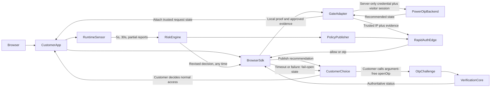

# PowerOTP BotBlocker Development Plan

Last updated: 2026-08-14 (clarified the additive advisory integration boundary;
execution remains governed by
[`POWEROTP_BOTBLOCKER_DEVELOPMENT_PHASES.md`](POWEROTP_BOTBLOCKER_DEVELOPMENT_PHASES.md))

Execution is split into small, dependency-ordered fresh-session phases in
[`POWEROTP_BOTBLOCKER_DEVELOPMENT_PHASES.md`](POWEROTP_BOTBLOCKER_DEVELOPMENT_PHASES.md).
That document is the implementation sequence and handoff rule; this document remains the
product and architecture specification.

## Purpose

PowerOTP BotBlocker is the primary PowerOTP product: a centrally managed bot-risk and
fraud-intelligence plugin installed additively in a customer's own website or request path.
The server adapter gathers trusted request data, communicates server-to-server with POWEROTP
using the customer's server-only site credential for initial session creation and narrow
server-held tokens thereafter, and publishes the resulting recommended website state through
the browser SDK. The customer
application remains the rendering/access enforcement point, but a supported integration is
expected to honor those instructions. POWEROTP never rewrites the customer's application code.

The recommended customer integration mounts the credential-free browser state provider before
its protected UI. While the provider reports `checking`, customer code may choose to defer its
own protected render/data fetch. The SDK checks available local clearance/Passport/access
proofs, gathers approved initial browser evidence, and combines it server-side with trusted IP
and request context for RapidAuth. POWEROTP returns exactly one of two decisions:

- `allow`: recommend normal access and continuously observe.
- `otp`: recommend that customer code close access and call the single argument-free
  `gate.openOtp()` API.

The customer chooses a decision timeout between 50 and 2,000 ms, 200 ms recommended. If the
timeout or a RapidAuth failure occurs first, the SDK publishes a fail-open access
recommendation. That lifecycle transition is not a fabricated backend `allow`: the pending
decision continues, and a verified late `otp` still replaces the current recommendation. A
blacklist match produces `otp`, never permanent denial.

**Customer-control limitation, stated plainly:** POWEROTP cannot guarantee that customer
content was withheld or that an instruction was followed because the customer controls the
enforcement code. The supported plugin contract maps `checking` to restricted/withheld access,
verified `allow` or fail-open to full access, and verified `otp` to restricted access plus the
single OTP call. Customers must structure their own SSR, data fetching, routing, and client
rendering to honor that mapping. POWEROTP cannot retract bytes the customer already delivered.

The existing OTP platform is the recovery and confidence mechanism: BotBlocker's `otp`
decision authorizes the same hosted challenge/iframe surface. Customer code makes one
argument-free `gate.openOtp()` call; POWEROTP selects the iframe's OTP method, content, and
policy server-side from the authenticated site/session decision and returns only short-lived
launch metadata. The site credential authenticates the first RapidAuth contact; POWEROTP then
returns a short-lived token bound to site, gate session, audience, expiry, and revocation, which
the customer adapter stores server-side. The empty same-origin opener request carries the
HttpOnly local gate-session cookie; the adapter resolves its server session and forwards only
that scoped token to POWEROTP. POWEROTP maps the token's gate session to the internal
user-intelligence record. Neither the session ID nor public site ID is authorization.
BotBlocker's evaluation combines fast signed-clearance checks, local IP intelligence, browser
consistency, decoy interactions, request velocity, and continuous post-load behavior.
Ambiguous or high-risk traffic receives an OTP recommendation rather than permanent denial,
and a previous `allow` or clearance may be revised to `otp`.

## Product invariants

- The Gate Adapter runs in the customer's own request path, gathers trusted data, performs
  initial RapidAuth/session creation with the server-only site credential, uses narrow
  server-held visitor tokens for later calls, and attaches the recommended state. It never
  blocks, rewrites, replaces, or consumes the customer's response itself; installed customer
  plugin code enforces the recommendation.
- A fresh signed site clearance is verified locally with a target of approximately 1 ms.
- A new-visitor RapidAuth decision targets less than 50 ms added latency from a nearby warm
  edge; this is a target, not a universal network guarantee, and it is independent of the
  customer-configured 50–2,000 ms advisory timeout described above.
- The decision is exactly one of two values, `allow` or `otp`. There is no third "deny" or
  "block" outcome. `checking`, fail-open, and unavailable are lifecycle states, not fabricated
  decisions.
- Website-facing recommendations are derived state, not additional decisions:
  - `checking` recommends restricted/withheld access.
  - verified `allow`, timeout fail-open, or unavailable fail-open recommends full access.
  - verified `otp` recommends restricted access and calling `gate.openOtp()`.
  - authoritative OTP success recommends full access.
- Every visitor is reassessed continuously, not just once: an initial browser/behavior report
  five seconds after load, recurring reports every 30 seconds, and partial reports on route
  navigation, page hide, close, or site exit. Every report is saved to the visitor's session
  and reruns scoring; any of these may revise a prior `allow` or valid clearance to `otp`.
- When customer code calls `gate.openOtp()`, monitoring pauses while the iframe is open and
  resumes in a fresh interval only after authoritative OTP success.
- Customer traffic stays on the customer's hosting platform. PowerOTP receives decision
  metadata, challenge traffic, summarized/sanitized risk events, and optional agent-access
  traffic — never the customer's page content.
- Collected behavior evidence is sanitized at the source: route path without query string or
  fragment, click element category and an explicit `data-powerotp-id` only (never clicked
  text or form values), mouse-directness/straight-line metrics between clicks (never
  coordinate trails), scroll smoothness and high-speed aggregate metrics (never raw scroll
  trails), and honeypot activations. Raw keystrokes, passwords, emails, DOM snapshots, page
  content, and arbitrary CSS selectors are never collected.
- PowerOTP owns risk weights, thresholds, threat feeds, challenge logic, and sensor cadence.
- Customers select protected routes, purchased OTP methods, optional PowerOTP-hosted
  CleanDataPages for agent access, the decision timeout (50–2,000 ms, 200 ms default), and
  emergency bypass behavior.
- Customers cannot choose the OTP method/content at iframe-open time. The single
  `gate.openOtp()` call accepts no method, policy, or challenge-content arguments; POWEROTP
  resolves the session's configured method server-side.
- The browser never supplies an API key, gate-session ID, site ID, user-intelligence ID, or OTP
  selection to `openOtp()`. Its empty same-origin request is bound by the HttpOnly session
  cookie; the server adapter retrieves its stored scoped gate-session token.
- Within the per-visitor flow, the site credential authenticates initial RapidAuth/session
  creation; separately authorized site-level configuration operations may still use it. The
  resulting short-lived gate-session token authorizes only that visitor's approved
  launch/status operations, is site/session/audience-bound and revocable, and remains
  server-side. It is sufficient for `openOtp()` without resending the broader site credential.
- No single weak IP, browser, behavioral, or decoy signal is treated as certain proof.
- Elevated risk surfaces OTP; it does not create an unrecoverable permanent denial.
- OTP proves access to a phone channel, not legal identity.
- Negative reputation is server-side state. A bot can delete a cookie, so a “blocked cookie”
  is not enforcement.
- PowerOTP may correlate pseudonymous fraud/security evidence across protected sites
  internally (see [Risk Engine and Reputation Store](#risk-engine-and-reputation-store)).
  A customer may query only observations belonging to its own project(s) — never another
  site's visitor history or raw events.
- Passport and runtime telemetry are purpose-limited security data. The extension does not
  collect or sell browsing or shopping histories.
- Production and development never use fake threat data, fake scores, fake blacklist matches,
  fake Passport approvals, fake paid entitlements, or synthetic OTP success. Mocks are
  test-only. Unfinished subsystems return explicit typed unavailable responses, and BotBlocker
  stays disabled for real customers until the backing phases and end-to-end tests are
  complete — see
  [`POWEROTP_BOTBLOCKER_DEVELOPMENT_PHASES.md`](POWEROTP_BOTBLOCKER_DEVELOPMENT_PHASES.md).
- Deployment is DigitalOcean-first: every capability ships on the existing DigitalOcean App
  Platform control plane before any Cloudflare-global-edge implementation is built. Cloudflare
  Workers are a later, additive latency optimization (see
  [RapidAuth Global Edge](#rapidauth-global-edge)), never a launch dependency.

## System flow

POWEROTP controls the recommended website state through an additive plugin protocol. The
customer's installed code is the enforcement point: it is expected to honor that state, but
POWEROTP cannot technically force compliance or alter customer code/content by itself.



## Components

### Gate Adapter

A small platform-specific package installed in the customer's request path. It starts or
continues the visitor gate session, collects trusted request/IP context, communicates with
POWEROTP using the customer's server-only site credential for first contact and scoped
server-held tokens thereafter, attaches a recommendation snapshot to framework-native request
state, and lets the customer handler/response continue untouched. Customer plugin code is
expected to enforce the snapshot in its own SSR, routes, APIs, and rendering.

- Verifies PowerOTP Ed25519-signed clearances and signed policy locally.
- Extracts client IP only from platform-approved trusted proxy headers.
- Calls RapidAuth for a fresh decision when clearance is absent, expired,
  revocation-positive, or reassessment is required. The browser SDK publishes fail-open state
  after the configured 50–2,000 ms timeout without canceling the in-flight decision.
- Exposes bounded same-origin bridge routes for bootstrap, evidence, decision verification,
  challenge status, and the single `openOtp()` launch path. The opener accepts an empty body,
  resolves the HttpOnly local gate session, retrieves its server-held scoped token, and makes
  the upstream request without resending the site credential; it does not open UI
  automatically.
- Sets HttpOnly cookies without exposing credentials to browser JavaScript.
- Uses a signed last-known-good policy with bounded timeout behavior.
- Never downloads or executes arbitrary backend code.

Planned packages, each a thin wrapper over one shared protocol so no customer rewrites their
integration when a wrapper changes:

- `libraries/gate-core`: framework-neutral browser state machine and shared protocol logic.
- `libraries/gate-node`: dependency-free raw Node HTTP wrapper (`http.createServer` request
  listeners) for customers not using Express or Next.js.
- `libraries/gate-express`: Express middleware/router wrapper.
- `libraries/gate-next`: Next.js native `proxy.ts`/App Router wrapper.
- `libraries/contracts/src/botblocker.ts`: the versioned protocol contracts all three wrappers
  share — see [Phase 1](POWEROTP_BOTBLOCKER_DEVELOPMENT_PHASES.md#phase-1--base-protocol-contracts).

Reference TypeScript/Node/React installation (Express shown; the raw Node HTTP and Next.js
wrappers expose the same `siteId`/`siteCredential`/timeout/`protect` options over their own
idiomatic APIs):

```typescript
import express from "express";
import { createPowerOtpBotBlocker } from "@powerotp/gate-express";

const app = express();
const botBlocker = createPowerOtpBotBlocker({
  siteId: process.env.POWEROTP_SITE_ID!,
  siteCredential: process.env.POWEROTP_SITE_CREDENTIAL!,
  audience: "https://customer.example",
  verificationKeys,
  decisionTimeoutMs: 200, // 50-2000, 200 recommended
  protect: ({ path, method }) =>
    method !== "OPTIONS" && !path.startsWith("/.well-known/health"),
});

app.use(botBlocker.middleware());
app.use(express.static("dist/client"));
app.use("/api", apiRouter);
app.get("/{*path}", renderReactApplication);
```

The middleware must precede static, SSR, and API handlers so it can attach trusted request
state and own `/_powerotp/*` bridge routes. It does not block those handlers, consume customer
bodies, or rewrite customer responses. React integrations receive an additive provider/hook;
the customer chooses where to mount it and how its state affects rendering.

### Signed Policy Client

The installed adapter remains stable while centrally controlled behavior arrives as declarative signed data.

- Policy fields include version, activation, expiration, site audience, protocol compatibility, risk weights, challenge mapping, edge endpoints, sensor version, verification keys, dataset versions, and revocation-filter metadata.
- The adapter verifies Ed25519 signatures and schema before activation.
- It caches a last-known-good policy and rejects unauthorized rollback.
- The only visitor-facing decision values are `allow` and `otp`; policy fields such as
  `agent_access` eligibility or browser-check cadence configure *how* PowerOTP arrives at that
  decision, they never add a third outcome.
- Policy releases use canary rollout and signed rollback.

Customer adapters contain public verification keys, never PowerOTP signing secrets. Existing `apps/api/src/interaction-tokens.ts` and `apps/api/src/security.ts` provide useful security patterns, but BotBlocker clearance and policy use asymmetric signatures.

### RapidAuth Global Edge

`apps/rapid-auth-edge` will run on Cloudflare Workers. The DigitalOcean application remains the control plane.

- Verifies site, request freshness, nonce, and protocol.
- Uses compact signed snapshots for bogons, Spamhaus DROP, Tor, cloud/datacenter prefixes, ASN class, and licensed proxy/residential intelligence.
- Uses edge/runtime cache plus Cloudflare storage; MongoDB and synchronous third-party APIs are excluded from the hot path.
- Scores request consistency, prior session/Passport reputation, abuse, velocity, browser evidence, and decoy events.
- Returns a short-lived, site-bound signed decision.
- Queues summarized risk events asynchronously to the DigitalOcean control plane.
- External reputation APIs are asynchronous enrichment or high-risk cache-miss tools only.

### Risk Engine and Reputation Store

Add durable, decaying entities instead of one global bad-IP flag:

- `botblockerSites`
- `siteSessions`
- `deviceReputations`
- `networkReputations`
- `identityBindings`
- `riskEvents`
- `policyReleases`
- `agentEntitlements`

Valkey handles short windows, rate limits, deduplication, challenge state, and event queues. MongoDB remains durable storage. Identity binding is explicit and customer-supplied; the browser sensor never scrapes email, password, or form values.

### Tokens and cookies

- `powerotp_access`: 2–5 minute site clearance verified locally.
- `powerotp_site_return`: longer site credential used to request fresh clearance; it cannot override server revocation.
- Gate token: seconds-long, one-time, original-route-bound challenge state.
- Passport root: optional device-key-bound registration, valid for up to one year and revocable.
- Passport site assertion: one-time and pairwise so sites cannot correlate a global Passport identifier.
- Agent entitlement: separate proof-of-possession machine credential.

Immediate remote revocation and zero lookups cannot both be guaranteed. Short access lifetime, fast edge refresh, and compact signed revocation filters provide the practical balance.

### Browser State SDK, OTP Opener, and Runtime Sensor

The credential-free browser SDK publishes current state and recommendation changes without
changing the customer's DOM itself. The supported customer integration uses that state to
place its own protected UI into restricted/withheld, full-access, or OTP-required mode.
When state is `otp`, customer code may call the one argument-free `gate.openOtp()` API.
POWEROTP then validates the site/session decision server-side and returns short-lived metadata
for the server-selected hosted iframe. The customer cannot select the OTP method or iframe
content in that call. Session continuity comes from the same-origin HttpOnly cookie, not a
caller-supplied identifier. The adapter retrieves the server-held scoped token minted by the
site-credential-authenticated first RapidAuth contact and forwards that token to POWEROTP.
POWEROTP resolves the gate session's internal user-intelligence relationship before selecting
iframe content. While an explicitly opened iframe is active, the runtime sensor pauses
customer-page observation and resumes a fresh interval only after authoritative success.

After an access recommendation, the runtime sensor:

- Aggregates trusted pointer, touch, keyboard, scroll timing, navigation velocity, repeated
  actions, and API velocity locally, then sanitizes it before sending:
  - Route path only, with query string and fragment stripped.
  - Click element category and an explicit `data-powerotp-id`, never clicked text or form
    values.
  - Mouse directness/straight-line metrics between clicks, never raw coordinate trails.
  - Scroll smoothness and high-speed aggregate metrics, never raw scroll trails.
  - Honeypot/decoy activations.
- Never transmits raw keystrokes, raw mouse trails, passwords, emails, DOM snapshots, page
  content, or arbitrary CSS selectors.
- Sends an initial report **five seconds** after load, recurring reports **every 30 seconds**,
  and a partial report whenever an interval is cut short by route navigation, page hide,
  close, or site exit. Every report is saved to the visitor's session and reruns scoring.
- Receives a fresh signed decision after every report; any of them may revise a prior `allow`
  or valid clearance to `otp` — reassessment is continuous, not one-shot.
- On a revised `otp`, publishes the new state immediately. Customer code decides whether to
  close its UI and invoke `gate.openOtp()`; POWEROTP never performs either action implicitly.
- Treats an AI/summary decoy activation as one centrally weighted risk signal, not permanent
  proof.

Versioned immutable sensor assets are selected through signed policy.

### OTP integration

Reuse the existing verification state machine, interaction-token protections, and callbacks.

- Add BotBlocker challenge orchestration with site/session/risk context.
- Implement the hosted challenge/widget route already anticipated by `libraries/widget-loader/src/index.ts`.
- Complete and production-test only the methods sold in the initial BotBlocker tier.
- Do not advertise unfinished `sms_code` or `voice_challenge`.
- Add challenge idempotency, timeout, retry, recovery, spend limits, number suppression, velocity limits, and abuse kill switches.

### PowerOTP Passport

After OTP, offer an optional Passport.

- Implement a no-extension top-level `verify.powerotp.com` redirect fallback.
- Publish purpose-limited Chrome/Edge and Firefox extensions after protocol review; Safari follows demonstrated demand.
- Generate a device key and register only its public key.
- Return pairwise site assertions and support pause, revoke, delete, device loss, and annual renewal.
- Passport avoids repeat OTP but does not disable ongoing rate and behavior controls.
- Each customer site receives only a per-site pairwise identifier
  (`HMAC(pepper, user_id || client_id)`); no PowerOTP cookie, cross-site cookie, or
  network-global identifier is ever exposed to a customer site. PowerOTP's internal
  cross-site fraud/security correlation (see
  [Risk Engine and Reputation Store](#risk-engine-and-reputation-store)) is a private,
  server-side capability that never leaves PowerOTP's own systems — see
  [`PASSPORT_BUSINESS_AND_LEGAL_PLAN.md`](PASSPORT_BUSINESS_AND_LEGAL_PLAN.md#portability-is-not-linkability)
  for the full identity-separation design.

### CleanDataPage agent content and payments

Participating site owners may publish one or more curated, machine-efficient AI summary pages
for each project. These **CleanDataPages are hosted by PowerOTP**, not by the customer's
website, so customers do not need to add or maintain a `/powerotp/aisummary` route. A project's
discovery document at `/.well-known/powerotp-agent` points to the applicable PowerOTP-hosted
offer/discovery metadata.

- Each CleanDataPage has a stable server-generated ID/serial number and a URL using a
  validated, unique project slug:
  `https://powerotp.com/{projectSlug}/cleandatapage/{serialNumber}`. A display name is never
  interpolated directly into the path, and the serial number is an identifier, not an
  authorization secret.
- Every CleanDataPage is independently enabled or disabled. Disabled pages are neither offered
  in the OTP iframe nor available through the hosted route, even to a previously issued token.
- Every enabled page is token-gated, including a free page. Access uses a short-lived,
  page-specific token bound to the project, CleanDataPage, audience, requesting agent/visitor
  session, issuance/expiry, and nonce. Bearer tokens are never placed in the URL, referrer, or
  logs.
- A page has an explicit access mode: `free`, with a displayed amount of `0.0000`, or `paid`,
  with a customer-configured non-negative four-decimal amount and explicit currency. A paid
  amount must be greater than zero. Monetary values use decimal strings or integer minor units,
  never binary floating point.
- A free request receives the same short-lived scoped viewing token after abuse/rate checks,
  without fabricating a paid entitlement. A paid request exchanges its valid PaidTokenPass
  access proof through a server-side, atomic, replay-protected entitlement consumption before
  PowerOTP issues the viewing token. Client-side payment success never grants page access.
- The existing hosted OTP iframe exposes separate “Human verification” and “Automated access”
  lanes. When a page's **Ad Revenue** toggle is active, eligible suspected bot/scraper visitors
  may be shown a clearly labeled CleanDataPage offer in the automated-access lane and may
  choose to open it. The toggle controls offer eligibility; it never changes an `otp` decision
  to `allow`, weakens OTP, or bypasses payment/token checks.
- Ad Revenue accounting requires auditable server-side impressions, accepted token exchanges,
  qualified visits, reversal/fraud handling, customer reporting, and explicit commercial/legal
  terms. Mere iframe rendering or a client-reported click is not billable evidence.
- Project cards manage CleanDataPages as nested rows when expanded. The first row and the `+`
  control use the same create flow, allowing a second and further pages without duplicate
  settings logic. Each row shows its own enable toggle, `free`/`paid` amount setting, Ad Revenue
  toggle, and Edit action.
- A collapsed project card shows compact per-page enabled/disabled status dots (green/red) and
  a paid-access dollar indicator (green when at least one enabled page is paid, gray otherwise).
  Text/tooltips and accessible names accompany color-only indicators.
- Customer-authored content is schema-limited and safely rendered with output encoding, a
  restrictive CSP, no arbitrary scripts, and size/type limits. It remains project-scoped and
  cannot expose another customer's content or visitor data.
- Version terms, permitted uses, scope, quotas, expiry, price changes, and content revisions.
- Start with prepaid balances and a server-side entitlement ledger.
- Add Coinbase x402 later as a payment/funding rail into the same ledger.
- Payment never restores a human Passport or disables general abuse controls.
- CleanDataPage is unrelated to the existing bot-signal honeypot at
  `GET /v1/modal-sessions/{sessionId}/ai-index-summary` (see [`AS_BUILT.md`](AS_BUILT.md)).
  The existing route remains an invisible detection trap on PowerOTP's hosted widget;
  CleanDataPage is deliberately discoverable, customer-curated content.

### Public MCP instruction system

`apps/web/app/mcp/route.ts` remains public, read-only, and free of customer data. It is documentation for the customer's AI, not an account-management or deployment service.

For every adapter, MCP publishes:

- How to recognize the platform/framework.
- Exact package/template version and checksum.
- Required file placement and middleware ordering.
- Required environment-variable names.
- Where the user finds credentials in the authenticated PowerOTP dashboard.
- How to place credentials in secure hosting environment settings.
- Test commands, verification steps, known exclusions, upgrade instructions, and troubleshooting.

MCP never reads or returns customer credentials, account state, project IDs, risk data, or deployment authorization. The customer's AI performs repository changes and guides dashboard/hosting clicks. Credentials never belong in source, browser JavaScript, chat output, logs, or MCP requests.

## Initial platform adapters

### TypeScript/Node/React

Three separate wrappers share one protocol (`libraries/contracts/src/botblocker.ts` plus
`libraries/gate-core`), so a customer never rewrites their integration when a wrapper gains a
capability:

- **Raw Node HTTP** (`libraries/gate-node`): a dependency-free wrapper over
  `http.createServer` request listeners, for customers not using Express or Next.js.
- **Express** (`libraries/gate-express`): the fullest-featured reference implementation,
  followed by Fastify only if the shared abstraction remains simple.
- **Next.js** (`libraries/gate-next`): a native Node-runtime `proxy.ts`/App Router wrapper.
  Next.js reserves literal underscore-prefixed App Router folders, so the on-disk bridge path
  is `app/%5Fpowerotp/[...path]/route.ts`, which emits the required public
  `/_powerotp/*` URL. `NextRequest` exposes no socket address; this wrapper therefore trusts no
  forwarding header and omits `clientIp` unless the deployment supplies an authenticated
  direct-peer resolver, after which the same explicit header/position/trusted-IP/count rules
  apply.

All three must handle trusted proxy IPs, CORS, health routes, callbacks, streaming, uploads,
WebSockets, SSR, static files, and protected APIs explicitly. All three expose the same
plugin-directed state, timeout, and `allow | otp` recommendation behavior; customer integration
code performs enforcement.

### Lovable

Use Lovable's advanced “Domain uses Cloudflare or a similar proxy” mode with a Worker deployed in the customer's Cloudflare account.

- Public MCP explains how to locate the Lovable origin and deploy the reviewed Worker template.
- The customer or their AI performs deployment and stores PowerOTP credentials in Worker secrets.
- The Worker gates locally, calls RapidAuth when needed, and forwards only approved requests to Lovable.
- Cloudflare HTMLRewriter inserts the sensor only into eligible HTML.
- Platform verification, certificates, health, callbacks, assets, and configured APIs receive explicit handling.
- PowerOTP does not relay the customer's page content.
- Without a supported edge proxy, Lovable receives only a clearly labeled soft/action-protection script.

### Later adapters

Next.js/Vercel is one of the three initial TypeScript/Node/React wrappers above, not a later
adapter.

- WordPress early-request plugin.
- Netlify Edge Function.
- Customer-owned Cloudflare Worker.
- Nginx/OpenResty and PHP adapters.
- Wix and Shopify remain action-specific until supported request paths permit whole-site gating.

## API surface

The canonical authenticated runtime origin is
`https://verify.powerotp.com/v1/botblocker/*`. That stable public origin is served by the
DigitalOcean application through Phase 26; the Phase 27 Cloudflare Worker takeover changes
the serving layer, not customer URLs. Operator-only routes use the separately authenticated
`/v1/control/botblocker/*` namespace.

- `POST /v1/botblocker/rapid-auth`
- `POST /v1/botblocker/browser-assessment`
- `POST /v1/botblocker/risk-events`
- `POST /v1/botblocker/challenges`
- `GET /v1/botblocker/challenges/{challengeId}`
- `POST /v1/botblocker/challenges/{challengeId}/complete`
- `GET /v1/botblocker/policy/{siteId}`
- `POST /v1/botblocker/passports/register`
- `POST /v1/botblocker/passports/assert`
- `POST /v1/botblocker/paid-passes/assert`
- `POST /v1/botblocker/agent/entitlements`
- `GET/POST /v1/projects/{projectId}/clean-data-pages`
- `GET/PATCH /v1/projects/{projectId}/clean-data-pages/{cleanDataPageId}`
- `POST /v1/clean-data-pages/{cleanDataPageId}/access-tokens` (free issuance or paid
  PaidTokenPass exchange; never accepts a client-declared entitlement)
- `GET /{projectSlug}/cleandatapage/{serialNumber}` (PowerOTP-hosted token-gated page)
- `GET /v1/projects/{projectId}/botblocker/visitors` (project-scoped; a customer can never
  query another project's visitors or raw events)
- `GET/PATCH /v1/projects/{projectId}/botblocker` (site configuration, including the
  50–2,000 ms decision timeout)
- `GET /.well-known/powerotp-agent`
- Operator-only: `/v1/control/botblocker/rapid-list`,
  `/v1/control/botblocker/decision-traces/{gateSessionId}`,
  `/v1/control/botblocker/health`, and `/v1/control/botblocker/policy-releases`.

Mutations require idempotency, replay protection, hostname/audience binding, bounded
timestamps, rate limits, and append-only audit events. Every route not yet backed by a real
implementation returns an explicit typed `*_unavailable` response — never a fabricated
decision, score, or approval. The exact request/response shapes are defined in
[Phase 1](POWEROTP_BOTBLOCKER_DEVELOPMENT_PHASES.md#phase-1--base-protocol-contracts) and
[Phase 2](POWEROTP_BOTBLOCKER_DEVELOPMENT_PHASES.md#phase-2--decision-challenge-and-proof-contracts).

## Failure and security rules

- RapidAuth failure or decision timeout publishes fail-open access state, while the original
  decision remains pending. The supported customer plugin maps that state to full access.
- A locally valid unexpired clearance remains usable during control-plane failure.
- An `otp` decision never changes customer UI automatically. The customer may call only the
  argument-free `gate.openOtp()` API; server-side site/session policy selects the OTP method
  and iframe content.
- Treat gate-session IDs as identifiers, never bearer authorization. The browser opener relies
  on the HttpOnly same-origin session; the server adapter forwards the narrow server-held
  gate-session token. The broader site credential is not resent for the launch request.
- Use strict timeout, circuit breaker, last-known-good policy, signed rollback, key-rotation overlap, and emergency customer bypass.
- Never trust arbitrary forwarded-IP headers.
- Test direct-origin bypass, token replay, open redirect, challenge fixation, policy rollback, credential leakage, and compromised edge/policy publication.
- CleanDataPage access fails closed for missing, expired, replayed, wrong-project, wrong-page,
  disabled-page, or unconfirmed paid-entitlement tokens. Page disablement and paid-access
  reversal take effect server-side and cannot depend only on token expiry.
- Treat customer-authored CleanDataPage content and labels as untrusted stored input; enforce
  project authorization on every management route and safe rendering on every hosted response.
- Keep ad-revenue qualification server-authoritative and resistant to self-clicks, automated
  click inflation, replay, and customer/visitor collusion.
- Apply separate retention and decay to IP, network, device, session, account, and Passport evidence.
- Perform privacy/legal review before cross-site reputation launch.
- See [`THREAT_MODEL.md`](THREAT_MODEL.md#botblocker-threat-model) for the full BotBlocker
  threat model, including the plugin-instruction/customer-enforcement boundary, API-key
  separation, and cross-project data-access controls.

## Development phases

The full 0–31 phase sequence (including lettered subphases), session-size rule, and required
handoff-prompt format live only in
[`POWEROTP_BOTBLOCKER_DEVELOPMENT_PHASES.md`](POWEROTP_BOTBLOCKER_DEVELOPMENT_PHASES.md#progressive-phases)
so there is exactly one canonical execution order. This document does not duplicate that list;
update it only when evidence invalidates a product/architecture assumption, and update the
phases document when execution order or scope needs to change. General handoff rules (limit
changes to the current phase, verify existing behavior first, prefer shared existing patterns,
keep modules under 200–300 lines, never overwrite `.env`, never add fake data, append the
BotBlocker as-built entry, never commit/push without explicit instruction) are defined once in
that document's
[Session-size and handoff rule](POWEROTP_BOTBLOCKER_DEVELOPMENT_PHASES.md#session-size-and-handoff-rule)
section and are not repeated here.
