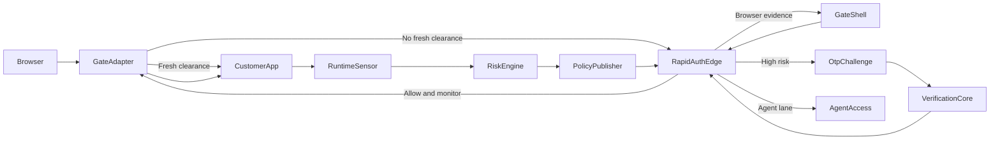

# PowerOTP BotBlocker Development Plan

Last updated: 2026-08-07

Execution is split into small, dependency-ordered fresh-session phases in
[`POWEROTP_BOTBLOCKER_DEVELOPMENT_PHASES.md`](POWEROTP_BOTBLOCKER_DEVELOPMENT_PHASES.md).
That document is the implementation sequence and handoff rule; this document remains the
product and architecture specification.

## Purpose

PowerOTP BotBlocker is the primary PowerOTP product: a centrally managed bot-risk gate installed in a customer's own request path. It prevents protected HTML and APIs from being served until PowerOTP returns an allow decision or the visitor completes the customer's available OTP challenge. PowerOTP does not relay the customer's normal website traffic.

The existing OTP platform is the recovery and confidence mechanism. BotBlocker combines fast cookie checks, local IP intelligence, browser consistency, decoy interactions, request velocity, and post-load behavior. Ambiguous or high-risk traffic is challenged rather than permanently denied.

## Product invariants

- The Gate Adapter runs before protected static HTML, SSR routes, APIs, login, registration, and account creation.
- A fresh signed site clearance is verified locally with a target of approximately 1 ms.
- A new-visitor RapidAuth decision targets less than 50 ms added latency from a nearby warm edge; this is a target, not a universal network guarantee.
- Customer traffic stays on the customer's hosting platform. PowerOTP receives decision metadata, challenge traffic, summarized risk events, and optional agent-access traffic.
- PowerOTP owns risk weights, thresholds, threat feeds, challenge logic, and sensor cadence.
- Customers select protected routes, purchased OTP methods, optional curated agent content, and emergency bypass behavior.
- No single weak IP, browser, behavioral, or decoy signal is treated as certain proof.
- Elevated risk surfaces OTP; it does not create an unrecoverable permanent denial.
- OTP proves access to a phone channel, not legal identity.
- Negative reputation is server-side state. A bot can delete a cookie, so a “blocked cookie” is not enforcement.
- Passport and runtime telemetry are purpose-limited security data. The extension does not collect or sell browsing or shopping histories.
- Production and development never use fake threat data. Mocks are test-only.

## System flow



## Components

### Gate Adapter

A small platform-specific package installed in the customer's request path.

- Verifies PowerOTP Ed25519-signed clearances and signed policy locally.
- Extracts client IP only from platform-approved trusted proxy headers.
- Calls RapidAuth only when clearance is absent, expired, revocation-positive, or a sensitive action requires reassessment.
- Serves a same-origin gate shell instead of invoking the customer application when challenged.
- Sets HttpOnly cookies without exposing credentials to browser JavaScript.
- Uses a signed last-known-good policy with bounded timeout behavior.
- Never downloads or executes arbitrary backend code.

Planned packages:

- `libraries/gate-core`
- `libraries/gate-node`
- `libraries/gate-next`
- `libraries/contracts/src/botblocker.ts`

Reference TypeScript/Node/React installation:

```typescript
import express from "express";
import { createPowerOtpBotBlocker } from "@powerotp/botblocker-node";

const app = express();
const botBlocker = createPowerOtpBotBlocker({
  siteId: process.env.POWEROTP_SITE_ID!,
  siteCredential: process.env.POWEROTP_SITE_CREDENTIAL!,
  protect: ({ path, method }) =>
    method !== "OPTIONS" && !path.startsWith("/.well-known/health"),
});

app.use(botBlocker.middleware());
app.use(express.static("dist/client"));
app.use("/api", apiRouter);
app.get("*", renderReactApplication);
```

The middleware must precede static, SSR, and API handlers. The package owns `/_powerotp/*` challenge/callback routes. Frameworks that cannot safely inject into streamed or compressed HTML receive an explicit React root sensor helper.

### Signed Policy Client

The installed adapter remains stable while centrally controlled behavior arrives as declarative signed data.

- Policy fields include version, activation, expiration, site audience, protocol compatibility, risk weights, challenge mapping, edge endpoints, sensor version, verification keys, dataset versions, and revocation-filter metadata.
- The adapter verifies Ed25519 signatures and schema before activation.
- It caches a last-known-good policy and rejects unauthorized rollback.
- Allowed operations are restricted to `allow`, `monitor`, `browser_check`, `otp`, and `agent_access`.
- Policy releases use canary rollout and signed rollback.

Customer adapters contain public verification keys, never PowerOTP signing secrets. Existing `apps/api/src/interaction-tokens.ts` and `apps/api/src/security.ts` provide useful security patterns, but BotBlocker clearance and policy use asymmetric signatures.

### RapidAuth Global Edge

`apps/rapid-auth-edge` will run on Cloudflare Workers. The DigitalOcean application remains the control plane.

- Verifies site, request freshness, nonce, and protocol.
- Uses compact signed snapshots for bogons, Spamhaus DROP, Tor, cloud/datacenter prefixes, ASN class, and licensed proxy/residential intelligence.
- Uses edge/runtime cache plus Cloudflare storage; MongoDB and synchronous third-party APIs are excluded from the hot path.
- Scores request consistency, prior session/Passport reputation, abuse, velocity, browser evidence, and decoy events.
- Returns a short-lived, site-bound signed decision.
- Queues summarized risk events asynchronously to the DigitalOcean control plane.
- External reputation APIs are asynchronous enrichment or high-risk cache-miss tools only.

### Risk Engine and Reputation Store

Add durable, decaying entities instead of one global bad-IP flag:

- `botblockerSites`
- `siteSessions`
- `deviceReputations`
- `networkReputations`
- `identityBindings`
- `riskEvents`
- `policyReleases`
- `agentEntitlements`

Valkey handles short windows, rate limits, deduplication, challenge state, and event queues. MongoDB remains durable storage. Identity binding is explicit and customer-supplied; the browser sensor never scrapes email, password, or form values.

### Tokens and cookies

- `powerotp_access`: 2–5 minute site clearance verified locally.
- `powerotp_site_return`: longer site credential used to request fresh clearance; it cannot override server revocation.
- Gate token: seconds-long, one-time, original-route-bound challenge state.
- Passport root: optional device-key-bound registration, valid for up to one year and revocable.
- Passport site assertion: one-time and pairwise so sites cannot correlate a global Passport identifier.
- Agent entitlement: separate proof-of-possession machine credential.

Immediate remote revocation and zero lookups cannot both be guaranteed. Short access lifetime, fast edge refresh, and compact signed revocation filters provide the practical balance.

### Browser Gate Shell and Runtime Sensor

The same-origin shell contains no protected customer content. It collects low-entropy browser consistency evidence and presents OTP, Passport, or agent access according to the signed decision.

After allow, the runtime sensor:

- Aggregates trusted pointer, touch, keyboard, scroll timing, navigation velocity, repeated actions, and API velocity locally.
- Never transmits raw keystrokes, raw mouse trails, passwords, emails, or page content.
- Sends an initial summary near 30 seconds, then uses less frequent healthy heartbeats and event-driven suspicious updates.
- Receives `renew`, `reassess`, or `challenge`.
- Shows an overlay for human UX while the Gate Adapter blocks future protected page/API requests.
- Treats an AI/summary decoy activation as one centrally weighted risk signal, not permanent proof.

Versioned immutable sensor assets are selected through signed policy.

### OTP integration

Reuse the existing verification state machine, interaction-token protections, and callbacks.

- Add BotBlocker challenge orchestration with site/session/risk context.
- Implement the hosted challenge/widget route already anticipated by `libraries/widget-loader/src/index.ts`.
- Complete and production-test only the methods sold in the initial BotBlocker tier.
- Do not advertise unfinished `sms_code` or `voice_challenge`.
- Add challenge idempotency, timeout, retry, recovery, spend limits, number suppression, velocity limits, and abuse kill switches.

### PowerOTP Passport

After OTP, offer an optional Passport.

- Implement a no-extension top-level `verify.powerotp.com` redirect fallback.
- Publish purpose-limited Chrome/Edge and Firefox extensions after protocol review; Safari follows demonstrated demand.
- Generate a device key and register only its public key.
- Return pairwise site assertions and support pause, revoke, delete, device loss, and annual renewal.
- Passport avoids repeat OTP but does not disable ongoing rate and behavior controls.

### Agent content and payments

Participating site owners may provide curated machine-efficient Markdown, text, or JSON instead of loading human presentation.

- Publish `/.well-known/powerotp-agent`.
- Expose explicit “Human verification” and “Automated access” lanes.
- Version terms, permitted uses, scope, quotas, and expiry.
- Start with prepaid balances and a server-side entitlement ledger.
- Add Coinbase x402 later as a payment/funding rail into the same ledger.
- Payment never restores a human Passport or disables general abuse controls.

### Public MCP instruction system

`apps/web/app/mcp/route.ts` remains public, read-only, and free of customer data. It is documentation for the customer's AI, not an account-management or deployment service.

For every adapter, MCP publishes:

- How to recognize the platform/framework.
- Exact package/template version and checksum.
- Required file placement and middleware ordering.
- Required environment-variable names.
- Where the user finds credentials in the authenticated PowerOTP dashboard.
- How to place credentials in secure hosting environment settings.
- Test commands, verification steps, known exclusions, upgrade instructions, and troubleshooting.

MCP never reads or returns customer credentials, account state, project IDs, risk data, or deployment authorization. The customer's AI performs repository changes and guides dashboard/hosting clicks. Credentials never belong in source, browser JavaScript, chat output, logs, or MCP requests.

## Initial platform adapters

### TypeScript/Node/React

Express is the reference implementation, followed by Fastify only if the shared abstraction remains simple. It must handle trusted proxy IPs, CORS, health routes, callbacks, streaming, uploads, WebSockets, SSR, static files, and protected APIs explicitly.

### Lovable

Use Lovable's advanced “Domain uses Cloudflare or a similar proxy” mode with a Worker deployed in the customer's Cloudflare account.

- Public MCP explains how to locate the Lovable origin and deploy the reviewed Worker template.
- The customer or their AI performs deployment and stores PowerOTP credentials in Worker secrets.
- The Worker gates locally, calls RapidAuth when needed, and forwards only approved requests to Lovable.
- Cloudflare HTMLRewriter inserts the sensor only into eligible HTML.
- Platform verification, certificates, health, callbacks, assets, and configured APIs receive explicit handling.
- PowerOTP does not relay the customer's page content.
- Without a supported edge proxy, Lovable receives only a clearly labeled soft/action-protection script.

### Later adapters

- Next.js/Vercel native `proxy.ts` and root sensor.
- WordPress early-request plugin.
- Netlify Edge Function.
- Customer-owned Cloudflare Worker.
- Nginx/OpenResty and PHP adapters.
- Wix and Shopify remain action-specific until supported request paths permit whole-site gating.

## API surface

- `POST /v1/botblocker/rapid-auth`
- `POST /v1/botblocker/browser-assessment`
- `POST /v1/botblocker/risk-events`
- `POST /v1/botblocker/challenges`
- `POST /v1/botblocker/challenges/{id}/complete`
- `GET /v1/botblocker/policy/{siteId}`
- `POST /v1/botblocker/passports/register`
- `POST /v1/botblocker/passports/assert`
- `POST /v1/botblocker/agent/entitlements`
- `GET /.well-known/powerotp-agent`

Mutations require idempotency, replay protection, hostname/audience binding, bounded timestamps, rate limits, and append-only audit events.

## Failure and security rules

- Ordinary public content defaults to fail-open during RapidAuth failure; sensitive actions may challenge using cached policy.
- A locally valid unexpired clearance remains usable during control-plane failure.
- Use strict timeout, circuit breaker, last-known-good policy, signed rollback, key-rotation overlap, and emergency customer bypass.
- Never trust arbitrary forwarded-IP headers.
- Test direct-origin bypass, token replay, open redirect, challenge fixation, policy rollback, credential leakage, and compromised edge/policy publication.
- Apply separate retention and decay to IP, network, device, session, account, and Passport evidence.
- Perform privacy/legal review before cross-site reputation launch.

## Development phases

Each phase is one focused development session. A new agent must first read this document, `docs/AS_BUILT.md`, `docs/POWEROTP_BOTBLOCKER_AS_BUILT.md` when it exists, current git status, prior phase changes, and relevant tests. It must not implement later phases early.

Each completed phase appends a dated entry to `docs/POWEROTP_BOTBLOCKER_AS_BUILT.md` containing:

- Phase and date.
- Outcome and architecture decisions.
- Exact files and migrations.
- Configuration and environment variables without secret values.
- Tests and results.
- Manual production/deployment steps.
- New findings and changes to this plan.
- Unresolved risks and next-phase prerequisites.

### Phase 0 — Specification and contracts

Materialize terminology, product specification, privacy/retention boundaries, trust model, SLOs, failure behavior, and complete protocol schemas. Update the threat model. Exit when token audiences/lifetimes, protected-route behavior, challenge recovery, and API semantics are unambiguous.

### Phase 1 — Cryptographic token and policy foundation

Implement Ed25519 signing/verification, key IDs, rotation overlap, timestamps, audiences, nonces, replay protection, the declarative policy schema/interpreter, signature verification, compatibility, last-known-good cache contract, and authorized rollback. Test forged, expired, wrong-site, replayed, downgraded, and rotated inputs. Build no edge service or platform adapter yet.

### Phase 2 — Risk model and control plane

Add BotBlocker site/session/device/network/event/policy collections, indexes, Valkey windows, retention/decay, kill switches, and authenticated dashboard/API operations for site credentials. Public MCP remains separate.

### Phase 3 — One-region RapidAuth and real IP intelligence

Build the reference decision path with real signed local datasets, central weighted scoring, signed decisions, and false-positive evaluation across VPN, CGNAT, mobile, corporate, IPv6, privacy-browser, cloud, and residential-proxy samples.

### Phase 4 — TypeScript/Node/React Gate Adapter

Build `gate-core`, Express reference adapter, protected challenge routes, React sensor hook, and public MCP installation documentation. Prove a sample React site's protected HTML is not reached before allow.

### Phase 5 — OTP challenge orchestration

Build the gate shell and existing-verification integration. Complete initial paid-tier transports and add idempotency, recovery, timeout, abuse, suppression, and spend controls. Prove end-to-end allow/challenge/return flows.

### Phase 6 — Runtime Sensor

Implement summarized adaptive behavior reporting, risk reassessment, token renewal, immediate challenge UX, and future request enforcement. Test accessibility, preview/prefetch decoy activations, copied profiles, deleted cookies, and automation velocity.

### Phase 7 — Cloudflare global RapidAuth

Port the validated reference path to Workers. Publish signed policy/IP snapshots from DigitalOcean, add queues, canaries, rollback, observability, probes, and failure controls, then measure global p50/p95/p99.

### Phase 8 — Lovable/customer-Cloudflare adapter

Build the reviewed customer-owned Worker template, Lovable origin flow, HTMLRewriter sensor insertion, exclusions, and public MCP instructions. Prove PowerOTP never relays customer content.

### Phase 9 — Passport

Build top-level redirect fallback, device registration, pairwise assertions, revocation/deletion/recovery, then Chrome/Edge and Firefox extensions. Complete browser-store and browser-storage testing.

### Phase 10 — Curated agent content and prepaid access

Build machine discovery, owner-authored summaries, terms, machine identity, entitlement ledger, prepaid funding, quotas, and scoped proof-of-possession credentials.

### Phase 11 — x402

Add Coinbase x402 into the same entitlement ledger with payment identifiers, replay safety, settlement confirmation, refunds, compliance events, and bundle/usage pricing.

### Phase 12 — More adapters and launch

Add adapters in demand order and complete accessibility, privacy/legal, load, disaster recovery, OTP abuse, origin bypass, false-positive, update, rollback, global probe, and runbook launch gates.

## Phase handoff rules

- Keep changes limited to the current phase.
- Verify existing behavior before editing.
- Prefer shared existing security, verification, queue, and contract patterns.
- Keep modules focused and generally below 200–300 lines.
- Never overwrite `.env`; document new variables and ask before changing local secret files.
- Never add fake development or production data.
- Update this plan when discoveries invalidate an assumption.
- Append the BotBlocker as-built entry before declaring a phase complete.
- Do not commit or push unless the user explicitly asks.
